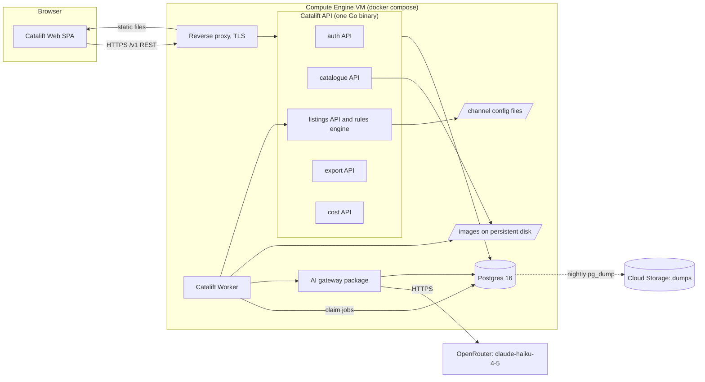

# High Level Design: Catalift

Version: v3

## Changes from v2

| Section | Change | Driven by | Impact |
| --- | --- | --- | --- |
| Summary, What gets built, 1, 3, 4 | backend areas 7 to 5: generation, rules and review merge into listings; attributes move into listings | eng review D3, D5 | section 1 needs the owner's yes again; tenets.md tenet 1 |
| What gets built, 14 | one repository CataliftApp instead of three | eng review D4 | repo-plan.json; ADR-0009 to supersede (TODOS.md) |
| 2. Users and flows | re-runs per product and channel with resume; regenerate applies only if field unchanged; Flow C rewritten around a stored budget-blocked state; image matching and existing-SKU rules | eng review D6, D12, D13, D20, D21 | backlog ACs to amend (TODOS.md) |
| 3. Architecture | rule re-check on config change; bad channel file disables only its channels; separate protected data disk | eng review D7, D8, D9 | ADR-0008 to supersede (TODOS.md) |
| 4, 5 | prompt record on AI calls; first-pass flag; 1024 px detection copy; start-run flags | eng review D19, D23, required by AC-US-00-003-4, -5 | data model |
| 6, 7 | CI bootstrap and scope; 3 attempts; 429 waits; key written by operator | eng review D10, D14, D15 | ADR-0005, ADR-0008 to supersede (TODOS.md) |
| 10 | backup alert by metric absence; certificate and web page checks (7 alerts) | eng review D11, D17, D18 | ADR-0010 to supersede (TODOS.md) |
| 11 | B2 from first-pass flag; B3 from `make eval-detect` | eng review D19, D22 | none |
| 12 | phase 0 bootstrap; data-disk protection; worker stop grace 75 s | eng review D9, D10, D16 | infra compose and Terraform |
| 16 | every critic finding marked fixed or accepted | eng review D3 to D25 | Status Draft to Reviewed |

- Task: none
- Author: unattributed, 2026-10-01
- Status: Reviewed
- PRD: docs/product/PRD.md
- ADRs: docs/architecture/decisions.md
- Tenets: docs/architecture/tenets.md

Serves: REQ-001 to REQ-021; US-00-001 to US-00-012; ADR-0001 to ADR-0010

Green field: the repository holds no code, so nothing below is sourced from code. Design choices cite their ADR or story; numbers and third-party behaviour not found in the repository are prefixed "assumption:".

## Summary

Catalift is one Go service exposing separate REST APIs per domain (auth, catalogue, listings, export, cost), a Go worker that runs every AI call from a Postgres job table through one cost-recording gateway to OpenRouter, a React single-page app, and one Postgres database, all in docker compose on a single Google Cloud VM. There is no broker, no cache, no object store and no marketplace integration: listings are checked by code against channel rules held as configuration, approved by a signed-in reviewer, and leave only as one CSV per channel.

Diagram: docs/architecture/diagrams/Catalift_SystemArchitecture_v1.svg

## What gets built

| Component | Kind | Stack | Responsibility | Repository |
| --- | --- | --- | --- | --- |
| Catalift Web | frontend | React, TypeScript, Vite, Tailwind CSS, shadcn/ui, TanStack Query and Table, axios | upload, progress, review grid, approvals, export download, cost views | CataliftApp |
| Catalift API | backend | Go, net/http, pgx, sqlc, goose | the domain REST APIs (auth, catalogue, listings, export, cost) and the rules engine; owns the database schema | CataliftApp |
| Catalift Worker | worker | Go (second command in the same module as the API) | claims jobs, runs detection, generation and regeneration through the AI gateway, validates results | CataliftApp |
| AI gateway | backend | Go package inside CataliftApi, used only by the worker | the one path to OpenRouter: budget check and reservation, call, token and cost record, recorded-response replay in tests | CataliftApp |
| Postgres | data | PostgreSQL 16 in Docker | system of record for every domain, the job table and sessions | CataliftApp |
| VM and proxy | infrastructure | Compute Engine VM, persistent disk, docker compose, reverse proxy (ADR needed), Terraform (ADR-0008), GitLab CI (ADR-0009), Ops Agent (ADR-0010) | runs the stack, TLS, serves the web build, disk snapshots and database dumps | CataliftApp |

## 1. Goal and non-goals

Catalift turns a seller's product CSV and photos into a title, 5 bullets and a description for each enabled channel, using AI to detect attributes and write the text through one gateway that records cost and stops spending past USD 8. A code-based rules engine checks every listing against its channel's configured rules, and a reviewer edits, regenerates single fields and approves listings in a grid. Only approved listings leave the system, as one CSV per channel; the backend is one Go service exposing separate REST APIs per domain (auth, catalogue, listings, export, cost), each owning its own tables in one Postgres database, plus a Go worker, a React app and that Postgres, all on a single Google Cloud VM.

Non-goals:

- Publishing listings to Amazon, Flipkart or any marketplace API; the output is CSV files a person uploads (PRD non-goals).
- Image editing, cropping or background removal (PRD non-goals).
- A third channel beyond the Flipkart-style stretch channel, which is added by configuration only (REQ-019, Q-007).
- Product categories other than apparel (Q-006).
- Self sign-up, password reset and single sign-on; the team seeds accounts (ADR-0006).
- Separate deployable services per domain; the domain APIs share one binary and can be split out later because no domain reads another domain's tables directly.
- High availability, autoscaling and zero-downtime deploys; one VM, short restarts accepted (ADR-0002).
- A screen for editing channel rules; rules are configuration files in the repository (US-00-005).
- Measuring B2 and B3 in the product; that waits on Q-024.

## 2. Users and flows

Actors: Seller and Catalogue reviewer (PRD section 4), both signed in with a role (ADR-0006); the operator (the team) who seeds accounts, deploys and holds the OpenRouter key.

### Flow A: seller turns a launch into draft listings

1. Seller signs in; the auth API sets a session cookie (ADR-0006).
2. Seller sets the brand's voice note once; the catalogue API stores it on the brand (US-00-003, Q-002).
3. Seller uploads the CSV; the catalogue API parses it, creates one product per valid row and returns rejected rows with reasons, including a SKU repeated in the file or already in Catalift; SKUs are unique in the database (US-00-001, Q-020, eng review D21).
4. Seller uploads images; the catalogue API stores each file on disk under a generated name and attaches it to the SKU its file name starts with, where the SKU must be followed by `_`, `-`, `.` or the end of the name and the longest matching SKU wins, so `TS-10_front.jpg` never attaches to `TS-1` (eng review D20); unmatched files and products with no image are listed (US-00-001, Q-005, Q-019).
5. Seller starts generation; the listings API, in one transaction, marks each product with an image as queued and inserts one detect job per product (ADR-0005).
6. The worker claims detect jobs, calls the AI gateway with a copy of the first image scaled so its long side is at most 1024 px (made once at upload; the original is unchanged, eng review D23), stores the five attributes, and in the same transaction enqueues one generate job per enabled channel (US-00-002).
7. The worker runs each generate job through the gateway with the attributes, CSV fields and voice note, then runs the rules engine on the result and stores the listing and its rule results in one transaction (US-00-003, US-00-004 AC-1).
8. The web app polls progress; the seller can close the page and come back (US-00-003 AC-6).
9. Late arrival and re-runs: a product uploaded after a run started is not added to that run. Starting generation again queues every (product, enabled channel) that has no listing or a failed or "stopped: budget" one, and skips detection where attributes already exist; a "resume failed and stopped" action does the same for one run (eng review D6). A newly enabled channel is therefore generated for existing products too.

### Flow B: reviewer fixes, approves and exports

1. Reviewer signs in and opens the grid; the listings API returns one row per product and channel with rule status and approval state (US-00-007).
2. Reviewer edits a field; the listings API saves it, raises the listing version, clears any approval and runs the rules engine synchronously, all in one transaction (US-00-007 AC-2 and AC-4, US-00-004 AC-6).
3. Reviewer corrects a detected attribute; the listings API saves it and, in the same transaction, raises the version of every listing of that product, clears their approvals and re-validates them (US-00-007 AC-3, Q-016, tenet 5, eng review D5).
4. Reviewer regenerates one field with an instruction; the listings API enqueues a regenerate job keyed by listing, field and request id, carrying the field's current value. When it finishes, the worker applies the new text only if the field still holds that starting value, then re-validates and clears approval; if the reviewer changed that field meanwhile, the result is dropped and the request shows "superseded by your edit". Either way the cost is added to the product (US-00-008, eng review D12).
5. Reviewer selects rows and approves; the listings API approves only rows whose rule status is passing at that moment and whose version matches what the reviewer saw, and reports how many were skipped (US-00-009, Q-009).
6. Reviewer exports; the export API reads approved listings in one snapshot and writes one CSV per channel with that channel's configured headers (US-00-010, Q-015).

### Flow C: the budget stops spending

1. The gateway is asked for a call when recorded spend plus in-flight reservations would pass USD 8 (REQ-021, Q-004).
2. It refuses without contacting OpenRouter and sets a stored "budget blocked" state; every queued detect, generate and regenerate job it refuses ends "stopped: budget" (US-00-012 AC-2, Q-021, eng review D13).
3. The web app shows the banner whenever the blocked state is on, with total recorded spend, whatever the exact figure.
4. The operator decides whether to raise the limit (a PRD change) or stop. After raising it, the operator clears the blocked state and the seller uses "resume failed and stopped" (eng review D6) to re-queue stopped work.

## 3. Architecture



**Catalift Web** (frontend owner, ADR-0003): a single-page app built by Vite and served as static files by the reverse proxy. It calls only `/v1` through one axios client generated from `api/openapi.yaml` (ADR-0007), with TanStack Query for server state and polling, and TanStack Table for the review grid.

**Reverse proxy** (operator): terminates TLS, serves the web build, forwards `/v1` to the API. ADR-0002 leaves Caddy or Nginx open: ADR needed: reverse proxy and TLS.

**Catalift API** (backend owner, ADR-0004, ADR-0007): one Go binary with five domain APIs under `/v1` (auth, catalogue, listings, export, cost). Each domain owns its tables and exposes a Go interface to the others; no domain queries another domain's tables (tenet 1). The listings domain owns everything that must agree about a listing: its text, version, rule results, approvals, edit history and regeneration requests, so approving, editing and re-validating are each one transaction inside one domain (eng review D3). The rules engine is pure code inside listings over a listing and a channel config, so the API (after edits) and the worker (after generation) call the same function. Channel configuration is loaded from files at start-up and validated; a broken file disables only its own channels, logs the channel and field, and shows an error banner, while the rest of the app runs (US-00-005 AC-3, eng review D8); `make check` validates every channel file before merge. Each rule result records the hash of the channel config it was checked against; at start-up every listing whose hash differs is re-validated and approvals that now fail are cleared, with the count logged and shown on the grid (eng review D7).

**Catalift Worker** (backend owner, ADR-0005): the same Go module started with a different command. It claims jobs from the job table with row locking and skip, at concurrency 4, and is the only process that calls the AI gateway. It writes results through the owning domain's Go interface, so ownership holds in the worker too.

**AI gateway** (backend owner, ADR-0004): a Go package with one entry point. Per call it reserves an estimated cost under a budget lock, refuses if spend plus reservations would pass USD 8, calls OpenRouter, then records tokens, cost and outcome. In tests it replays recorded responses keyed by request and makes no network call (PRD Constraints).

**Postgres** (operator runs it, API owns the schema): PostgreSQL 16 in a container with its data on the VM's persistent disk (PRD Constraints, ADR-0002). Migrations run once per deploy before the API and worker start.

**Image store**: a directory on the same data disk as Postgres, written by the catalogue API and read by the worker (PRD Constraints).

**Data disk** (operator): Postgres data and images live on a separate attached persistent disk, not the VM's boot disk. Terraform marks the data disk and the dump bucket `prevent_destroy`, the VM has deletion protection, and the manual apply job refuses any plan that destroys or replaces either, so replacing the VM never touches the data (eng review D9).

**Risks this leaves open**

- One VM, one disk: a disk or zone failure takes the service down and loses data newer than the last snapshot or dump (ADR-0002).
- API and worker share one database; a runaway export or grid query slows job claiming and the reverse. Mitigated only by small volume.
- Domain separation is a convention in one binary; nothing in the compiler stops a cross-domain query. Tenet 1 and review are the only guards until an import-boundary check is added in the LLD.
- `brg_design_variants` from the brief has no place in this design (Q-017, conflict 2); if it turns out to matter, a component is missing.

## 4. Data

One Postgres database; each domain owns its tables. Full model: `data-model` produces docs/design/data-model.md (not written yet).

| Domain | Entities | PII | Retention |
| --- | --- | --- | --- |
| auth | users (email, role, password hash), sessions | email, password hash | users kept; sessions expire after 7 days (assumption:) and are purged daily |
| catalogue | brands (voice note), uploads, upload row errors, products, product images (path on disk, plus a 1024 px detection copy, eng review D23) | none | kept for the life of the deployment |
| listings | product attributes (eng review D5), listings (product, channel, title, 5 bullets, description, version, rule status, approval state, first-pass result and failing rule names set once at first generation, eng review D19), rule results per listing version, approvals (listing, version, reviewer, time), field edit history, regeneration requests; channel config is files, not tables | reviewer id | listings and approvals kept as the audit trail; rule results for the latest version kept, older purged |
| export | exports and their files (path, channel, row count) | none | files kept 30 days (assumption:) |
| cost | AI calls (job, product, purpose, model, prompt template id and rendered prompt, input and output tokens, cost, status, provider generation id) | none | kept; it is the spend ledger |
| platform | jobs (type, key, status, attempts, run after, claimed by, lease until) | none | done jobs purged after 30 days (assumption:) |

Growth, per 300-SKU launch on two channels (assumption: 2 images per SKU): 300 products, 600 images, 600 listings, about 900 jobs, about 900 AI calls plus regenerations, about 2,000 rule results. The budget allows about 1.5 to 2 such launches in total (section 8), so the database stays under about 10,000 rows per table and the image directory under 1 GB (assumption: 0.5 MB per drawn image).

Migrations implied: the first migration creates every table above; goose runs forward-only, expand then contract (go-api stack).

Two systems, one change: an image upload writes the file to disk first, then the row. A crash between leaves an orphan file and no row; a daily sweep deletes files with no row older than one day. A row never points at a missing file.

**Risks this leaves open**

- Losing the disk loses images and data together; recovery depends on snapshots and nightly dumps (ADR needed: backups and DR).
- A row-level copy of an image is not kept anywhere else, so images are restorable only from the disk snapshot, not from the dump.
- The data model is not written; a table this section implies could be missed until `data-model` runs.

## 5. Interfaces

All HTTP contracts live in `api/openapi.yaml` (new, ADR-0007), versioned under `/v1`, cookie session auth with CSRF token on every state-changing call.

| Interface | Kind | Contract | Stories |
| --- | --- | --- | --- |
| `/v1/auth` (login, logout, me) | REST, new | api/openapi.yaml | ADR-0006 |
| `/v1/brands`, `/v1/uploads` (multipart CSV), `/v1/uploads/{id}/images` (multipart), `/v1/products` | REST, new | api/openapi.yaml | US-00-001, US-00-002 |
| `/v1/generation-runs` (start with a voice-note check and a "confirm neutral voice" flag, progress, resume failed and stopped) | REST, new | api/openapi.yaml | US-00-003 |
| `/v1/channels` (read-only list and rules) | REST, new | api/openapi.yaml | US-00-005 |
| `/v1/listings` (grid, filter, edit), `/v1/listings/{id}/regenerate` | REST, new | api/openapi.yaml | US-00-004, US-00-007, US-00-008 |
| `/v1/approvals` (bulk) | REST, new | api/openapi.yaml | US-00-009 |
| `/v1/exports`, `/v1/exports/{id}/files/{channel}` (CSV download) | REST, new | api/openapi.yaml | US-00-010 |
| `/v1/costs`, `/v1/budget` | REST, new | api/openapi.yaml | US-00-011, US-00-012 |
| Job types `detect_attributes`, `generate_listing`, `regenerate_field` | job table rows, new | docs/design/jobs.md (to write in the LLD) | ADR-0005 |
| Channel configuration | YAML files, new | config/channels/schema.json | US-00-005, US-00-006 |
| Export CSV per channel | file, new | headers from config/channels/*.yaml | US-00-010, Q-015 |
| OpenRouter chat completions | outbound HTTPS | OpenRouter API reference | US-00-002, US-00-003, US-00-008 |

## 6. External integrations

### OpenRouter (claude-haiku-4-5)

Used for attribute detection (image in), listing generation and single-field regeneration (PRD Constraints). Only the worker calls it, through the AI gateway.

- Down or erroring: a job gets 3 attempts (the first, then retries after 10 seconds and 1 minute) and then ends `failed` with the reason on the product (ADR-0005, eng review D14). The seller sees per-product "failed" and can start the run again for failed products.
- Slow: each call has a 60 second timeout (assumption:). A timed-out call is recorded as possibly charged at its reserved cost and retried within the attempt limit (ADR-0005 check 3).
- Rate limited (HTTP 429): the job is rescheduled after the reply's Retry-After (30 seconds if absent) without using one of its 3 attempts; if it is still rate limited 1 hour after its first try it ends `failed: rate limited` (eng review D15). Concurrency 4 keeps the steady rate low. assumption: a 429 is not charged. assumption: the key's rate limit is well above 4 concurrent requests.
- Spend: the gateway blocks past USD 8 (REQ-021). assumption: OpenRouter lets the operator set a credit limit on the key itself; set it to USD 10 as a second stop the code cannot bypass.
- Credential: the OpenRouter key is read by the worker only, from a root-only env file on the VM written once by the operator, never by a CI job (ADR-0009; ADR needed: secrets). If it leaks, the operator revokes it in the OpenRouter dashboard and issues a new one; the key-level USD 10 limit caps the damage.

### Google Cloud

Compute Engine VM and persistent disk (ADR-0001, ADR-0002), disk snapshots, and a Cloud Storage bucket for nightly database dumps. If the zone is down, Catalift is down until it returns or the disk snapshot is restored into another zone (UNDEFINED: no tested procedure yet).

Artifact Registry holds the API, worker and web images (ADR-0009); if it is unavailable, running containers keep running and only deploys fail. Cloud Logging and Monitoring receive logs and metrics from the Ops Agent and run the uptime checks and alerts (ADR-0010); if they are unavailable, the product is unaffected and alerts are silent for that time. Every resource here is created by Terraform with state in a versioned Cloud Storage bucket (ADR-0008).

### GitLab (build and deploy path, not runtime)

GitLab CI runs checks on every merge request, builds images and runs the manual deploy and Terraform apply jobs (ADR-0009). It authenticates to Google Cloud through Workload Identity Federation, so no service account key is stored in GitLab. The trust link and the CI service account are created once by hand from a small bootstrap Terraform folder, together with the state bucket; WIF trusts only the Catalift project's protected `main` and protected environment `prod`, and the CI account holds named roles (compute, storage on the two buckets, DNS, monitoring, Artifact Registry writer, service account user), never owner (eng review D10). If GitLab or its runners are down, the running product is unaffected; deploys wait, or the operator runs the same make targets by hand.

### Deliberately not integrated

- Marketplace APIs (Amazon SP-API, Flipkart): publishing is a PRD non-goal; output is CSV.
- Cloud Storage for product images: the PRD fixes local image storage; one disk keeps the deploy simple.
- A hosted identity provider (Firebase Auth, Auth0, Google IAP): a handful of seeded users does not justify it (ADR-0006).
- A message broker or Redis: the job table covers about 900 jobs a launch (ADR-0005).
- Product analytics SDK (PostHog, GA4): success measures come from domain tables (section 11).
- Error tracking SaaS (Sentry): structured logs and Cloud Logging cover two users; revisit if real sellers use it.
- Direct Anthropic API or Vertex: the brief names OpenRouter for one capped key.

**Risks this leaves open**

- OpenRouter is the only AI path, with no fallback provider; an outage stops detection and generation entirely.
- Charging for timed-out calls is unverified; if it is charged and not reported, recorded spend undercounts real spend until reconciled with the OpenRouter dashboard.
- The VM's env file holds the key in plain text on disk; anyone with VM root reads it.
- The manual deploy job needs SSH or IAP access from the runner to the VM; the access path is a standing way into the VM and is not designed yet (LLD).

## 7. Failure modes

| Component | What fails | How it is noticed | What the user sees | How it recovers |
| --- | --- | --- | --- | --- |
| Catalift Web | build broken or bad deploy | uptime check on `/` fails | blank page or error | redeploy the previous web build |
| Reverse proxy | certificate renewal fails or process down | uptime check on `/healthz` fails; certificate expiry alert at 14 days | browser certificate error or connection refused | restart container; renew certificate manually |
| Catalift API | process crash or panic | uptime check on `/v1/healthz`; container restart count in logs | requests fail; the app shows "service unavailable" | docker restart policy restarts it; sessions survive in Postgres |
| Catalift API | bad channel config file | `make check` fails the merge; at start-up the loader logs the channel and field | that channel is missing from the grid and export, with an error banner | fix the file and redeploy; other channels keep working (eng review D8) |
| Catalift Worker | crash mid-job | jobs with expired leases; `stale_jobs` count in logs | progress stalls for up to the 2 minute lease | restart policy; the stale-claim sweep returns the job, counting the attempt |
| AI gateway | budget passed | gateway refusal logged; spend banner | "AI calls blocked: USD x spent" banner; remaining products "stopped: budget" | operator raises the limit (PRD change) or stops; no automatic recovery |
| AI gateway | crash between OpenRouter response and cost record | reservation row still `pending` after the lease | nothing; cost shows the reserved estimate | sweep marks it `possibly charged` at the estimate; operator reconciles with the OpenRouter dashboard monthly |
| OpenRouter | 5xx, 429 or timeout | `ai_call_failures` count in logs; alert on rate | product shows "failed: provider error" after 3 tries | seller restarts the run for failed products |
| OpenRouter | malformed or off-format output (wrong bullet count, missing attribute) | parse failure counted per job | treated as a failed attempt; after 3, "failed: unusable output" | retry; the rules engine catches format problems that parse |
| Postgres | container down or disk full | uptime check fails; disk usage alert at 80% | every request fails | restart; free disk; restore from snapshot or dump if corrupt |
| Image directory | disk full | disk usage alert at 80% | upload fails with "storage full" | grow the disk (online resize) |
| VM or zone | VM stopped or zone outage | uptime check fails | site unreachable | restart VM; zone outage restore procedure is UNDEFINED |
| Export | edit lands during an export | none needed | the file reflects the snapshot at export start | re-export; approval is cleared by the edit so the edited row will not appear until re-approved |

Check then act: approval reads rule status and version in the same `UPDATE` that sets it, so a listing edited between the grid load and the click is skipped and reported, not approved. The budget check and the reservation happen under one lock, so four concurrent calls cannot each see room under USD 8 and all proceed.

Side effect then record: the OpenRouter call happens after the reservation row commits and before the result commits. The design accepts a possible duplicate charge on retry after a crash (a few cents) and never a lost charge, because the reservation is counted until reconciled.

Retries are bounded: a detect or generate job is useless once the seller has restarted the run, so a restart cancels the run's queued jobs before enqueueing new ones. Retries wait in the job table with a `run after` time; they never block other jobs.

## 8. Scaling and limits

Expected load (assumption: from PRD section 1, REQ-018 and Q-018, not measured): a launch is 300 SKUs on 2 channels, about 900 AI calls; two users; a handful of launches in the life of the budget.

Stated by the owner on 2026-10-04: Catalift is a demo application with one environment and a peak of about 10 users a minute. At that load API traffic is negligible (well under 1 request a second); the AI budget and the OpenRouter rate limit stay the only real limits.

Worst window: one full generation run. 900 calls at concurrency 4 and assumption: 3 to 5 seconds each gives 900 × 4 s / 4 = 900 seconds, about 15 minutes, at about 1 call per second. The grid during that window serves at most 600 rows to one or two users; API load is negligible.

First bottleneck: the AI budget, not compute. assumption: USD 0.01 to 0.02 per product for detection plus two channels (Q-018 estimate at USD 1 per million input and USD 5 per million output tokens). USD 8 / 0.015 ≈ 530 products in total, about 1.8 full launches, before every AI call is refused. Regenerations and retries spend from the same USD 8. The design meets B1 for one launch; a second full launch, or the stretch Flipkart channel (a third listing per product, about 33% more generation cost), may not fit. No design choice changes this: raising the limit is a PRD change owned by the product owner (Q-004, Q-018).

Second bottleneck: OpenRouter rate limits, unknown (assumption: above 4 concurrent requests). Concurrency is one setting; doubling it halves the 15 minutes if the limit allows.

Parallelism: job claims use row locking with skip, so adding a second worker process is safe; the budget lock is in Postgres, so it holds across processes. The per-process concurrency of 4 multiplies by the number of worker processes; with 2 workers the provider sees 8.

Numbers agree: one job is one AI call; the 2 minute lease is longer than the 60 second call timeout plus the result transaction, so a healthy job never loses its claim. The stale-claim sweep runs every minute.

Where the design stops working: past about 5,000 rows in one grid view, client-side TanStack Table needs server paging (assumption:); past one VM's disk (resizable online) or CPU (a 2 vCPU VM, assumption:, is far above this load); past one person's patience if a run takes hours, which would need about 10,000 SKUs per run at today's rate.

**Risks this leaves open**

- The budget covers about 1.8 launches; the demo can run out of AI spend before B1 is shown twice (Q-018).
- The per-product cost is an estimate; measure it on 10 SKUs before the first full run (Q-018).
- OpenRouter's limit for this key is not known; a 429 storm would slow the run, not break it.

## 9. Security and privacy

Auth model: own login with seeded accounts, roles seller and reviewer, server sessions in Postgres, secure HTTP-only cookie, CSRF token on state-changing calls (ADR-0006). All routes except login and health need a session; there is nothing public.

Authorisation per resource (single organisation; every signed-in user sees every brand and product, assumption: one seller organisation per deployment):

| Resource | Seller | Reviewer |
| --- | --- | --- |
| brands, uploads, products, images | create, read | read |
| generation runs | start, read progress | start, read progress |
| listings | read | read, edit, regenerate a field |
| product attributes | read | edit (Q-016) |
| approvals | refused (403) | create |
| exports | refused (403) | create, download |
| costs and budget | read | read |

The API enforces each cell; the web app hides what the API refuses (conflict 1).

PII: user emails and password hashes only. Product data and listings are business data. Nothing is sent to OpenRouter except product images, CSV fields, attributes and the voice note.

Untrusted input: CSV cells, file names, the voice note and reviewer instructions all reach prompts. Prompt injection can at worst produce odd listing text, which the rules engine and a human reviewer see before export; no model output is executed or used to choose an action. Uploads are size-capped (assumption: 5 MB CSV, 10 MB per image), images are type-sniffed and stored under generated names, never the uploaded path. CSV export escapes cells that start with `=`, `+`, `-` or `@` so a spreadsheet does not run them as formulas.

Secrets: OpenRouter key (worker only), Postgres password, session signing secret if used. Where they live: ADR needed: secrets (ADR-0002 offers Secret Manager or a root-only env file).

**Risks this leaves open**

- Own password storage: a weak hash setting or missing login rate limit exposes accounts; the LLD must set both.
- One organisation per deployment: if a second seller is ever added to the same deployment, every seller sees every other seller's products.
- A leaked key spends up to the OpenRouter key limit before anyone notices.

## 10. Observability

- Logs: JSON structured logs (slog, go-api stack) from API and worker to stdout, collected by docker and shipped to Cloud Logging by the Ops Agent on the VM (ADR-0010). Every log line from a job carries job id, product id and run id. assumption: about 5 MB of logs per launch, inside the free allowance.
- Metrics: the API and worker expose Prometheus metrics (go-api stack): jobs by status, AI calls by outcome, spend in USD, request latency. The Ops Agent scrapes them into Cloud Monitoring (ADR-0010); no Prometheus server runs.
- Alerts: defined as Cloud Monitoring alert policies in Terraform (ADR-0008), notifying the owner by email (ADR-0010). The CataliftDown uptime check runs from outside the VM. CataliftBackupMissing uses a metric-absence condition on a log-based metric that counts the dump job's fixed success line, so Google fires it after 26 hours with no success whether the VM died or only the dump job stopped; it is tested once by stopping the job (eng review D11).
- Traces: OpenTelemetry is in the go-api stack, but no trace backend is planned for two users; traces are off.

| Alert | Condition | Runbook |
| --- | --- | --- |
| CataliftDown | uptime check on `/v1/healthz` fails for 2 minutes | docs/runbooks/catalift-down.md |
| CataliftDiskHigh | VM disk over 80% | docs/runbooks/disk-high.md |
| CataliftAiFailing | more than 20 failed AI calls in 10 minutes | docs/runbooks/ai-failing.md |
| CataliftSpendNearLimit | recorded spend passes USD 6 | docs/runbooks/spend-limit.md |
| CataliftBackupMissing | no dump-success log line for 26 hours (metric absence, judged by Cloud Monitoring) | docs/runbooks/backup-missing.md |
| CataliftCertExpiring | the `/v1/healthz` uptime check sees a certificate expiring within 14 days (eng review D17) | docs/runbooks/cert-expiring.md |
| CataliftWebDown | uptime check on `/` gets no HTTP 200 or no `catalift-web` marker for 2 minutes (eng review D18) | docs/runbooks/web-down.md |

**Risks this leaves open**

- Email is the only alert channel and goes to one person; an alert during their absence waits.
- If the Ops Agent stops, metric-based alerts (AI failing, spend near limit) go silent while the uptime checks still pass; nothing alerts on missing metrics yet.
- Runbooks named above do not exist yet; `runbook` writes them.

## 11. Analytics

No analytics store or SDK: every question below is answered by SQL over the domain tables, run by the team. The approval and edit history in the listings domain is the audit trail and is not used as an event stream.

| Question | Source | Notes |
| --- | --- | --- |
| How long from upload to export? (B1) | uploads created time to exports created time | measures inside Catalift only; the marketplace upload is outside |
| What share of listings pass the rules at first generation? (B2) | the first-pass result on each listing (eng review D19) | needs Q-024 to be accepted as a REQ before it is a product feature |
| How accurate is detection on the 30 labelled products? (B3) | `make eval-detect`, run by hand: live detection on the 30 labelled drawn images, accuracy per attribute (eng review D22) | needs the labelled set (Q-013); spends from the USD 8 block; not a product feature until Q-024 |
| What does each product and launch cost? (B5) | AI calls summed by product and run | lower bound until possibly-charged calls are reconciled |
| How often do reviewers regenerate or edit, and which fields? | edit history and regenerate jobs | shows where generation is weak |

**Risks this leaves open**

- B2 and B3 have no owner in the product until Q-024 is answered; the numbers may be produced by hand once.
- Cost per product undercounts if timed-out calls are charged but not reported.

## 12. Rollout and rollback

Controls (operator owned, separate from anything users set): `AI_MODE` environment setting on the worker, `replay` (recorded responses, no spend) or `live`; the OpenRouter key-level credit limit; the Flipkart-style channel file present or absent.

| Phase | What happens | Back out | Work in flight |
| --- | --- | --- | --- |
| 0. Infrastructure | the owner applies the bootstrap folder once by hand (state bucket, WIF, CI account; eng review D10); then the manual GitLab `terraform apply` job (ADR-0008, ADR-0009) creates the VM, disk, snapshot schedule, buckets, Artifact Registry, DNS, the Ops Agent policy and the alert policies; compose starts Postgres and the proxy | apply the previous Terraform commit; destroy and recreate only before phase 1, after which the data disk and dump bucket are protected (eng review D9) | none |
| 1. Replay mode | API, worker and web deployed by the manual GitLab deploy job with `AI_MODE=replay`; team runs the whole flow on recorded responses | rerun the manual deploy job with the previous image tag (ADR-0009) | queued jobs stay in the table; the previous worker runs them if their types exist in it, and leaves unknown types queued |
| 2. Live, 10 SKUs | `AI_MODE=live`, key limit USD 10, run 10 SKUs, measure cost per product (Q-018) | set `AI_MODE=replay` and restart the worker | in-flight calls finish or time out within 60 seconds; queued jobs then run in replay |
| 3. Full launch | 300 SKUs, then review and export | `AI_MODE=replay`; listings already generated stay | as phase 2 |
| 4. Stretch | add the Flipkart-style channel file (US-00-006) | remove the file and restart; its listings remain in the database, hidden because the channel is not configured | queued Flipkart jobs fail with "unknown channel" and end `failed`, with no AI call |

Migration order: migrations run in a one-shot container before the API and worker start; each is additive in the same release (expand), and a column or table is dropped only in a later release (contract). Rolling back the image never needs a down migration, because the previous release reads the expanded schema.

Deploys stop the worker with a signal; it stops claiming, finishes its in-flight calls (60-second timeout), then exits. The worker's compose service sets `stop_grace_period: 75s` so docker does not kill it first (eng review D16). A job cut off past that returns after its 2 minute lease.

**Risks this leaves open**

- Deploys cause a short outage (seconds to a minute) for both users; acceptable per ADR-0002, but a deploy during a run pauses it.
- Recorded responses for replay mode must be captured once in live mode; until then phase 1 runs on hand-written fixtures.
- No tested restore yet: a failed restore in phase 3 loses the launch's review work.

## 13. Outside the standard stack

- Cloud Logging and Monitoring with the Ops Agent (observability, ADR-0010): the catalogue default is OpenTelemetry with the Grafana stack; Architect or Engineering Manager sign-off pending.
- axios (frontend, ADR-0003): the react-web kit uses its own fetch client; Architect or Engineering Manager sign-off pending.
- Own job table instead of a library (messaging, ADR-0005): the catalogue default; no sign-off needed, listed for visibility only.
- OpenRouter (llm provider, PRD Constraints): the catalogue default for prototypes; becomes outside the standard stack if Catalift goes past the demo; Architect sign-off pending for production use.
- Reverse proxy, Caddy or Nginx (compute, ADR-0002): ADR needed; neither is the catalogue default (cloud load balancer); sign-off pending once chosen.
- docker compose on a single VM (compute, ADR-0002): a catalogue option, not the default (managed containers); Engineering Manager sign-off pending.

## 14. Repository plan

Mirrors docs/architecture/repo-plan.json. One repository (eng review D4): a release is one commit SHA, and an API contract change, its generated client and its handler land in one merge request.

| Repository | Path | Stack id | Responsibility | Apps |
| --- | --- | --- | --- | --- |
| CataliftApp | Catalift/Server/CataliftApp | none (react-web, go-api and infra kits in subdirectories) | the web app, the domain REST APIs, the rules engine, the worker, the AI gateway and the infrastructure; owns the database schema | apps/web, cmd/api, cmd/worker, infra |

## 15. Decisions and conflicts

10 ADRs indexed in docs/architecture/decisions.md, all Accepted; 2 conflicts settled by Karthik Reddy, 0 open.

ADRs needed:

- ADR needed: reverse proxy and TLS (Caddy or Nginx), from ADR-0002.
- ADR needed: secrets (Secret Manager or root-only env file), from ADR-0002.
- ADR needed: backups and DR (snapshot schedule, dump retention, restore drill).

## 16. What the review found

Reviewed by: critic, 2026-10-01

Compared: HLD sections 1 to 17 against ADR-0001 to ADR-0007, tenets.md, decisions.md, repo-plan.json, PRD.md, backlog.md (US-00-001 to US-00-012) and questions.md. No data model exists to compare against.

### BLOCKER: The approval guard needs SQL across domains, which tenet 1 forbids

Section 7 says "approval reads rule status and version in the same `UPDATE` that sets it". Section 4 puts rule status, version and approval state on `listings`, which the generation domain owns, and puts `approvals` in the review domain. Flow B step 2 has the review API raise the listing version and clear approval "in one transaction". Flow B step 5 and the export snapshot in step 6 also read data from three domains (review, generation, catalogue attributes) as one consistent view. Tenet 1 says no domain queries another's tables, and the Go interfaces have no way to share a transaction. Approval state is also stored twice: `listings.approval state` and `approvals`. REQ-015 and Q-022 rely on this guard.

Conflicts with: tenet 1, tenet 5, HLD sections 4 and 7, Flow B steps 2, 3, 5 and 6, AC-US-00-009-3, AC-US-00-010-3 and AC-US-00-010-4

Fix: Give one domain ownership of listing text, version, rule status and approval (review, or merge it into generation). Alternatively, state that domain interfaces accept a caller-owned `pgx.Tx` so cross-domain writes and the export snapshot commit together. Remove the duplicated approval state. HLD sections 4 and 7 take the change, and data-model must follow it.

Status: fixed (eng review D3: listings, rule results and approvals in one area)

### MAJOR: Correcting an attribute does not clear approval, but attributes are exported

Flow B step 3 only re-validates after an attribute edit. Tenet 5 requires every write to "its product's attributes" to raise the listing version and clear approval in the same transaction. Q-015 puts detected attributes in the export CSV. As written, a corrected attribute ships under an approval that was given to the old value.

Conflicts with: tenet 5, Q-015, Q-022, AC-US-00-007-3, REQ-015

Fix: In Flow B step 3, for every listing of the product: raise the version, clear approval and re-validate, all in one transaction (this depends on the BLOCKER fix).

Status: fixed (eng review D5: attributes in listings, one transaction)

### MAJOR: Re-running generation cannot recover partial products or add the stretch channel

Flow A step 9 queues "only products without listings". This misses three cases. A product with one channel listed and the other failed or "stopped: budget" already has a listing, so it is never re-queued; section 6 says the seller can re-run failed products, which disagrees. A re-run starts again from the detect job, so detection is paid for twice even when attributes are stored. In phase 4, existing products already have listings, so AC-US-00-006-2 ("each product gets a Flipkart-style listing") cannot be met. Nothing explains how stopped work resumes after the limit is raised (Flow C step 3).

Conflicts with: Flow A step 9, section 6 (Down or erroring), section 12 phase 4, AC-US-00-006-2, AC-US-00-012-2, Q-021

Fix: Select work per (product, channel) that has no listing, and skip detection when attributes exist. Define a "resume stopped and failed" action on `/v1/generation-runs`. Flow A step 9 and the jobs.md contract take this.

Status: fixed (eng review D6: re-run per product and channel, resume action)

### MAJOR: A channel config change leaves stored rule statuses stale, and approval trusts them

Rules load at start-up (section 3). Status is computed only after generation or an edit. Approval reads the stored status. If the title limit is lowered (AC-US-00-005-4), every existing listing keeps its old "passing" status, so it can still be approved and exported. Separately, AC-US-00-005-3 says only the bad file's channels are disabled, while the HLD stops the whole start-up. The "health gate" in the section 7 row is not designed: under compose, the API and worker will restart in a loop.

Conflicts with: REQ-008, Q-009, tenet 3, AC-US-00-005-3, AC-US-00-005-4, HLD section 7 (bad channel config row)

Fix: Store a hash of the config with each rule result. At start-up, re-validate every listing whose hash differs, and clear approvals that now fail. Pick one of "refuse start-up" or "disable that channel" and change either the AC or the HLD. Name the deploy health check in CataliftInfra.

Status: fixed (eng review D7 config hash re-check; D8 disable bad channel, CI check)

### MINOR: The B2 measure needs data the retention rule deletes

Section 11 computes B2 from "rule results for listing version 1". Section 4 keeps only the "latest version's results; older purged".

Conflicts with: HLD section 4 (rules row), section 11 (B2), Q-024

Fix: Keep the version 1 results, or store a first-pass flag on the listing.

Status: fixed (eng review D19: first-pass flag on listings)

### MINOR: No stored prompt to check the voice note and instruction ACs against

AC-US-00-003-4 says the voice note is "visible in the recorded prompt for the call", and AC-US-00-008-3 needs the instruction in the prompt. The cost ledger in section 4 records no prompt. AC-US-00-003-5 (confirm a neutral default before the run) also has no place in `/v1/generation-runs`.

Conflicts with: HLD sections 4 and 5, AC-US-00-003-4, AC-US-00-003-5, AC-US-00-008-3

Fix: Add a prompt (or a prompt hash plus template id and inputs) to AI calls. Add a voice-note precondition and confirm flag to the start-run contract.

Status: fixed (sections 4 and 5: rendered prompt on AI calls; confirm-neutral-voice flag on start)

### MINOR: A regeneration can silently overwrite a reviewer's edit, and its job key collides

The `regenerate_field` job applies its result without checking the listing version it was built from. A reviewer edit made while the job is in flight is lost. ADR-0005 check 6 keys jobs by "product, step and channel", with no field or request id. Two regenerations on one listing (title, then bullet 3) therefore either collapse into one or overwrite each other.

Conflicts with: tenet 4 ("guard re-read when the job runs"), ADR-0005 check 6, Flow B step 4, AC-US-00-008-1

Fix: Carry the base version in the payload. On mismatch, either drop the result or apply it to that field only and report a conflict. Key regenerate jobs by listing, field and request id.

Status: fixed (eng review D12: apply only if field unchanged; key by listing, field, request)

### MINOR: The attempt counts disagree, and 429s use them up

Section 6 says retries happen "at 10 seconds, 1 minute and 5 minutes, then" the job fails, which is 4 attempts. ADR-0005 says it fails "after the third failure", and section 7 says "after 3 tries". A 429 counts as an attempt, so a 429 storm ends jobs `failed`. That contradicts section 8, which says it "would slow the run, not break it". Stale-claim returns and deploy cut-offs also use attempts.

Conflicts with: ADR-0005 check 4, HLD sections 6, 7 and 8

Fix: State one attempt count. Treat a 429 as a reschedule (honouring Retry-After) that does not use an attempt.

Status: fixed (eng review D14: 3 attempts; D15: 429 waits without using an attempt)

### MINOR: The 60 second drain does not fit docker compose's default stop timeout

Section 12 lets the worker finish a call for up to 60 seconds. Compose sends SIGKILL after 10 seconds by default, so each deploy during a run leaves possibly-charged reservations and uses up attempts.

Conflicts with: HLD section 12, section 8 (numbers agree)

Fix: Set `stop_grace_period: 75s` on the worker in CataliftInfra compose, and say so in section 12.

Status: fixed (eng review D16: stop_grace_period 75s)

### MINOR: The banner and "blocked" conditions disagree

The gateway refuses when spend plus reservations "would pass" USD 8, so recorded spend can stop at, say, USD 7.97. AC-US-00-012-1 and AC-US-00-012-3 trigger on spend "above USD 8", so the banner may never show. Flow C also marks "the run's remaining jobs", but `regenerate_field` jobs belong to no run.

Conflicts with: HLD section 3 (AI gateway), Flow C, AC-US-00-012-1, AC-US-00-012-3

Fix: Drive the banner from a persisted "budget blocked" state, and say how queued regenerations are stopped.

Status: fixed (eng review D13: stored budget-blocked state)

### NIT: The settled conflicts were not carried into the product docs

decisions.md requires changes to AC-US-00-009-5, the US-00-007 and US-00-009 assumptions, Q-014 and Q-017. backlog.md and questions.md still say "seller mode" and "no authentication". HLD section 15 reports "0 open".

Conflicts with: decisions.md, backlog.md US-00-007 and US-00-009, questions.md Q-014 and Q-017

Fix: Apply the listed edits through `prd` and the backlog.

Status: accepted (Karthik Reddy, eng review D25: TODOS.md P1 product doc sync)

**Weakest claims (critic).**

1. "A row never points at a missing file" (section 4). A restore from the nightly dump onto a disk snapshot from another time gives rows with no files, or files with no rows. Falsify with: restore one dump plus one snapshot taken hours apart, then count image rows whose path is missing.
2. "USD 8 / 0.015 ≈ 530 products, about 1.8 launches" (section 8). The reservation estimate, possibly-charged timeouts counted at that estimate, and up to 4 attempts per job all spend from the same USD 8. Falsify with: the planned 10-SKU live run, recording the reserved total against the actual total.
3. "Concurrency 4 is well under the rate limit; a 429 storm slows, not breaks" (sections 6 and 8). Falsify with: read the key's limit and rate limit from OpenRouter's key-info endpoint, then fire 8 concurrent image calls once.

**Not said (critic).**

- Re-uploading an existing SKU: whether it is a new product, an update, or rejected. There is no delete path for a wrong upload, and the stale rows stay in grids and cost totals.
- How "possibly charged" rows are corrected in the ledger after reconciliation (which mechanism, who does it, through which API).
- In replay mode: whether replayed calls write cost rows to the live ledger, and what happens on a replay miss.
- SKU prefix ambiguity: `TS-1` is a prefix of `TS-10_front.jpg`.
- Monthly running cost of the VM, disk, snapshots and bucket next to the USD 10 AI budget.

Verdict (critic): do not approve until the BLOCKER is fixed; approve after the four MAJOR findings are fixed.


Reviewed by: critic, 2026-10-04 (v2 changed sections only; the v1 findings above stand unchanged)

### MAJOR: Phase 0 cannot run from the GitLab apply job, and the CI identity is not scoped

Section 12 phase 0 says "the manual GitLab `terraform apply` job (ADR-0008, ADR-0009) creates the VM, disk, ...". Section 6 says CI authenticates "through Workload Identity Federation" and "Every resource here is created by Terraform". The WIF pool, the provider and the service account the job impersonates have to exist before that job can authenticate at all, so the first apply has to run from somewhere else, and neither ADR-0008 (which bootstraps only the state bucket by hand) nor the HLD says where. That service account also needs enough IAM to create compute, storage, DNS, monitoring, OS policy and IAM bindings, which is close to project owner. Nothing says which GitLab project, ref or protected environment the WIF attribute condition trusts. "No service account key is stored in GitLab" is true, but it does not answer who can mint that identity.

Conflicts with: HLD section 12 phase 0, section 6 (Google Cloud, GitLab), ADR-0008 Consequences (only the state bucket is bootstrapped by hand), ADR-0009 Decision

Fix: In ADR-0008 Consequences and HLD phase 0, add a one-time bootstrap: state bucket, WIF pool and provider, and the CI service account, applied by hand from the operator's credentials. In section 6, state the WIF attribute condition (CataliftInfra project path, protected `main`, protected environment) and list the CI service account's roles.

Status: fixed (eng review D10: hand-applied bootstrap, scoped CI identity)

### MAJOR: CataliftBackupMissing has no mechanism that fires, and section 10 contradicts itself

Section 10 says "Uptime checks run from outside the VM, so CataliftDown and CataliftBackupMissing fire when the VM is gone." An uptime check probes a URL; it cannot see the newest object in a bucket. ADR-0010 puts the backup alert on "log-based or scraped metrics", and both of those come from the VM. Section 10's own risk says "nothing alerts on missing metrics yet". The likeliest real failure is a dump cron that stops while the VM stays up; a log-based "dump succeeded" metric then simply goes absent, and as written nothing fires. This is a silent failure on the backup that every restore story depends on.

Conflicts with: HLD section 10 (Alerts bullet, table row, risks), ADR-0010 Context ("must fire when the VM itself is gone") and Decision

Fix: In HLD section 10 and the ADR-0010 Decision, base CataliftBackupMissing on a Google-side signal with an absence condition: either a metric-absence condition on a log-based metric that the dump job emits on success, or a bucket-side signal such as a Cloud Storage object-finalize notification or the storage object count. Drop the "uptime checks" wording for this alert.

Status: fixed (eng review D11: success log line with metric-absence alert)

### MAJOR: Where the deploy job lives and what a release is disagree across artifacts

ADR-0009 runs "GitLab CI in each" repository, with a manual deploy job that "pulls and restarts the compose stack". HLD section 14 and repo-plan.json give "the manual deploy and apply jobs" to CataliftInfra only. The images are built in CataliftApi and CataliftClient, while the compose file lives in CataliftInfra, so nothing records which API tag, web tag and compose revision make up one release. Phase 1's back-out, "rerun the manual deploy job with the previous image tag", is therefore ambiguous: which tag, set from which repository? Phase 0 says "compose starts Postgres and the proxy", but ADR-0008 says compose is not Terraform's job, and the deploy job only arrives in phase 1, so nothing owns that step.

Conflicts with: ADR-0009 Decision, HLD section 14, repo-plan.json CataliftInfra.responsibility, HLD section 12 phases 0 and 1, ADR-0008 Consequences

Fix: Name one deploy job in CataliftInfra. It takes the API and web image digests as inputs and records them in a committed release file or in compose variables; CataliftApi and CataliftClient only build and push. Rollback means redeploying a previous release file. Move "compose starts Postgres and the proxy" into phase 1, or give it to that job. ADR-0009 and HLD section 12 take the change.

Status: fixed (eng review D4: one repository, a release is one commit)

### MAJOR: A routine Terraform apply can replace the VM and the data with it

Phase 0's back-out is "apply the previous Terraform commit, or destroy and recreate; nothing to lose yet". The same apply job runs for the life of the project. Nothing in the HLD or ADR-0008 says that Postgres data and images sit on a separate persistent disk from the boot disk, that this disk and the dump bucket carry `prevent_destroy`, or that a plan which replaces the VM is blocked. Changing the image, the machine type in some cases, or the startup metadata can force a replacement; with data on the boot disk, an approved manual apply then deletes the launch. ADR-0008 calls this "cheap", which understates the risk.

Conflicts with: HLD section 12 phase 0, section 4 risks, ADR-0002 Consequences (persistent disk holds everything), ADR-0008 Reversibility

Fix: State in ADR-0008 Consequences and HLD section 3 (Postgres, Image store) that the data sits on a separate attached disk with `prevent_destroy` and `deletion_protection`, that the dump bucket has `prevent_destroy`, and that the apply job refuses a plan that destroys either. Limit phase 0's "destroy and recreate" to before phase 1.

Status: fixed (eng review D9: separate protected data disk)

### MINOR: The OpenRouter key is "written at deploy", but no job may hold it

Section 6 (OpenRouter, Credential) has the key in "a root-only env file on the VM written at deploy". ADR-0009 says "No job runs with a live OpenRouter key; the live key stays on the VM only". Deploys are now a GitLab job, so "written at deploy" means the key passes through a GitLab CI variable.

Conflicts with: HLD section 6 (OpenRouter), ADR-0009 Consequences, ADR needed: secrets (section 15)

Fix: Change section 6 to "written once by the operator, not by the deploy job", or move the key to Secret Manager and have the VM's service account read it. Record the choice in the secrets ADR.

Status: fixed (section 6: key written once by the operator, never by CI)

### MINOR: Section 7 promises checks that the five Terraform alerts do not include

Section 7 relies on an "uptime check on `/`", an "uptime check on `/healthz`" and a "certificate expiry alert at 14 days". ADR-0010 and section 10 define exactly five alerts with a single uptime check on `/v1/healthz`. The ADR's reversibility claim ("recreate five alerts") fixes that count.

Conflicts with: HLD section 7 (Web, Reverse proxy rows), section 10 table, ADR-0010 Decision

Fix: Add a certificate-expiry condition to the uptime check, plus a `/` check, to the section 10 table and the ADR-0010 Decision. Otherwise change the section 7 rows to the checks that actually exist.

Status: fixed (eng review D17 certificate alert; D18 web page check)

### MINOR: ADR-0008's resource count and pending note are stale after v2

ADR-0008 says "about 8 resources" and "the deploy pipeline (ci decision, pending)". v2 adds Artifact Registry, an Ops Agent policy, 5 alert policies, at least one uptime check, a notification channel, log-based metrics, a WIF pool and provider, a CI service account and its bindings, and the dump bucket: closer to 25 to 30 resources. The "cheap" grade still holds, but its stated basis is wrong.

Conflicts with: ADR-0008 Context, Reversibility and Consequences; decisions.md row ADR-0008; ADR-0009

Fix: Update the count and point the pending note to ADR-0009 through `tech-decision`.

Status: accepted (Karthik Reddy, eng review D24: TODOS.md P1 ADR sync)

**Weakest claims in v2 (critic).**

1. "shipped to Cloud Logging by the Ops Agent on the VM", "collected by docker" (section 10). The Ops Agent does not support Container-Optimized OS, the usual docker image, and nothing names the VM's OS; docker's json-file logs also need an explicit files receiver. Falsify with: check the Ops Agent supported-OS list against the intended image, then on a Debian 12 VM add a `files` receiver on `/var/lib/docker/containers/*/*.log` and look for one container line in Logs Explorer.
2. "CataliftDown and CataliftBackupMissing fire when the VM is gone" (section 10). Falsify with: write the BackupMissing condition in HCL and grep it for `condition_absent` or a bucket-side metric; if neither appears, the claim is false on paper.
3. "If GitLab or its runners are down ... the operator runs the same make targets by hand", with "no service account key is stored" (section 6). Falsify with: ask the operator which credentials a hand-run `make deploy` and `terraform apply` would use and with what roles; if the answer is personal owner credentials on a laptop, the fallback is the option ADR-0009 rejected.

Verdict (critic, v2): approve after fixing the four MAJOR findings above; the v1 BLOCKER still stands on its own.


## 17. Open questions and assumptions

| Item | Owner | Answer by |
| --- | --- | --- |
| assumption: cost per product USD 0.01 to 0.02; measure on 10 SKUs (Q-018) | Karthik Reddy | 2026-10-08 |
| assumption: OpenRouter allows a key-level credit limit and returns a generation id usable for reconciliation | Karthik Reddy | 2026-10-08 |
| assumption: OpenRouter rate limit is above 4 concurrent requests for this key | Karthik Reddy | 2026-10-08 |
| assumption: whether a call that timed out on our side is charged | Karthik Reddy | 2026-10-08 |
| assumption: a 429 reply is not charged (eng review D15) | Karthik Reddy | 2026-10-08 |
| assumption: 3 to 5 seconds per AI call; 60 second timeout | Karthik Reddy | 2026-10-08 |
| assumption: one seller organisation per deployment; every user sees every product | Karthik Reddy | 2026-10-08 |
| assumption: 2 images per SKU, 0.5 MB each; upload caps 5 MB CSV and 10 MB per image | Karthik Reddy | 2026-10-08 |
| assumption: sessions 7 days, done jobs and export files purged after 30 days | Karthik Reddy | 2026-10-08 |
| assumption: a 2 vCPU VM | Karthik Reddy | 2026-10-08 |
| assumption: alerts go by email to the owner only (ADR-0010) | Karthik Reddy | 2026-10-08 |
| assumption: GitLab shared runners are available, or a runner is provided for the deploy job | Karthik Reddy | 2026-10-08 |
| How the deploy job reaches the VM (SSH key or IAP tunnel) | Karthik Reddy (operator) | 2026-10-15 |
| assumption: TanStack Table client-side is fine to about 5,000 rows | Karthik Reddy | 2026-10-08 |
| Raise the USD 8 limit if one launch is not enough? (Q-004, Q-018) | Karthik Reddy (product owner) | 2026-10-08 |
| Zone outage restore procedure (section 6, 7) | Karthik Reddy (operator) | 2026-10-15 |
| What does `brg_design_variants` do for Catalift? (Q-017) | Karthik Reddy | 2026-10-08 |
| Accept Q-024 as a REQ so B2 and B3 are measured in the product? | Karthik Reddy | 2026-10-08 |

## Revision history

### Changes from v1 (2026-10-04)

| Section | Change | Driven by | Impact |
| --- | --- | --- | --- |
| What gets built | VM and proxy row names Terraform, GitLab CI and the Ops Agent | ADR-0008, ADR-0009, ADR-0010 | repo-plan.json CataliftInfra tech |
| 6. External integrations | Google Cloud adds Artifact Registry, Cloud Logging and Monitoring; GitLab added as the build and deploy path | ADR-0009, ADR-0010 | Terraform resources in CataliftInfra |
| 10. Observability | logs and metrics shipped by the Ops Agent; alerts emailed; risks re-examined | ADR-0010 | runbooks still to write |
| 12. Rollout and rollback | phase 0 by manual Terraform apply; deploys and back-outs by the manual GitLab deploy job | ADR-0008, ADR-0009 | CataliftInfra pipeline |
| 13. Outside the standard stack | Cloud Logging and Monitoring added for sign-off | ADR-0010 | Architect or Engineering Manager sign-off |
| 15. Decisions and conflicts | 10 ADRs; iac, ci and observability no longer needed | ADR-0008, ADR-0009, ADR-0010 | none |
| 17. Open questions and assumptions | Ops Agent assumption removed; alert recipient and runner assumptions added | ADR-0009, ADR-0010 | none |

- v1, 2026-10-01: first version.

## Decision ledger

Engineering review (/plan-eng-review, 2026-10-04) of this HLD v2. Report file: this HLD.

### Scope record

feature answers: none proposed (no cuts offered; US-00-006 already Could); structure: B Smaller arrangement (D3, 2026-10-04); accepted scope: backend areas reduced from 7 to 5 (auth, catalogue, listings, export, cost, plus the platform job table); listings owns listing text, versions, rule results, approvals, edit history and regeneration requests, absorbing generation, rules and review; feature list, stories and section 5 routes unchanged; section 1 wording changes and needs the owner's yes; pending remedies: HLD-B1, HLD-M1 to HLD-M7, HLD-m1 to HLD-m9.

### R1: Repository layout (three repositories or one)
Finding: SC1, P2, confidence 7/10, docs/architecture/repo-plan.json ("CataliftClient", "CataliftApi", "CataliftInfra" entries), reviewer: plan-eng-review Scope Challenge; overlaps critic v2 MAJOR "Where the deploy job lives and what a release is disagree".
Plan baseline: three repositories per HLD section 14 and repo-plan.json (v1, 2026-10-01; no explicit owner answer on layout).
Runtime evidence: none; no repositories exist yet.
Comparison grid:
| Choice | Current | A | B |
| --- | --- | --- | --- |
| R1 repo layout | three repos (Client, Api, Infra) | one monorepo `Catalift` with apps/web, cmd/api, cmd/worker, infra/ | three repos kept; CataliftInfra deploy job takes API and web image digests and commits a release file |
| Release identity | undefined | one commit SHA of the monorepo | a committed release file in CataliftInfra |
| Contract change (tenet 7) | two MRs in two repos | one MR | two MRs in two repos |
| Kit scaffolding | one kit stack per repo | stack "none" with a stack_note; web, api and infra kits scaffolded into subdirectories | one kit stack per repo |
| HLD-M (critic deploy/release MAJOR) remedy | pending | resolved by layout | pending, its fix becomes the plan |
Question D4:
D4: Keep three repositories, or put Catalift in one?
Project/branch/task: Catalift HLD v2, section 14 and docs/architecture/repo-plan.json.
ELI10: The plan splits the code into three repositories: the web app, the Go backend, and the infrastructure. You are one developer. Every API change touches the contract in the backend repo and the generated client in the web repo, so it takes two merge requests, and a deploy has to pair the right web image with the right backend image by hand. One repository makes each change one merge request and each release one commit.
Stakes if we pick wrong: three repos means contract drift and an undefined "release" (a critic MAJOR); one repo means the Bearing kit cannot scaffold it in one command.
Recommendation: A because one developer, one contract and one deploy target fit one repository, and it removes a MAJOR finding instead of patching it.
Note: options differ in kind, not coverage; no completeness score.
Pros / cons:
A) One monorepo (recommended)
  ✅ An API change, its generated client and its handler land in one merge request
  ✅ A release is one commit SHA; rollback means redeploying an older commit
  ❌ Bearing's new-repo cannot scaffold three stacks at once; subdirectories are scaffolded one by one (human: ~2h / CC: ~15min)
B) Keep three repositories
  ✅ Each repo gets its kit stack, CI template and checks from new-repo directly
  ✅ Matches the current repo plan and ADR-0009's "GitLab CI in each" wording
  ❌ Needs a release file and digest-pinned deploy job in CataliftInfra, plus two-MR contract changes forever
Net: one repo and one commit per change, or three repos with kit scaffolding and a release file to keep them in step.
Header: D4 Repos
Options:
A) One monorepo (recommended)
One repository `Catalift` with apps/web (react-web kit), cmd/api and cmd/worker (go-api kit), infra/ (infra kit); repo-plan stack "none" with a stack_note; a release is one commit SHA.
B) Keep three repositories
CataliftClient, CataliftApi, CataliftInfra as planned; CataliftInfra's single deploy job takes both image digests and commits a release file; rollback redeploys an older release file.

State: approved
Actual answer: A) One monorepo (recommended), D4, 2026-10-04
Accepted scope: one repository `CataliftApp` (git path Catalift/Server/CataliftApp) with apps/web (react-web kit), cmd/api and cmd/worker (go-api kit), infra/ (infra kit); repo-plan stack "none" with a stack_note; a release is one commit SHA; HLD section 14 and the What gets built Repository column follow; ADR-0009's "GitLab CI in each" wording needs a superseding ADR (named, not written).
History: none

### Factual resolution: HLD-B1 (critic v1 BLOCKER, approval guard across domains)
Resolved by the D3 structure answer: listings, rule results and approvals now sit in one listings domain, so the approval guard is one domain transaction and tenet 1 holds. No question needed. Section 16 status updates to fixed (D3) at report time. The attribute part of the same finding is R2.

### R2: Where product attributes live
Finding: A1, P1, confidence 8/10, HLD Flow B step 3 "the catalogue API saves it and asks the listings domain to re-validate", reviewer: plan-eng-review Architecture (critic v1 MAJOR "Correcting an attribute does not clear approval").
Plan baseline: attributes owned by catalogue (HLD v1 section 4); no owner answer.
Runtime evidence: none; no code.
Comparison grid:
| Choice | Current | A | B |
| --- | --- | --- | --- |
| R2 attribute owner | catalogue | listings | catalogue |
| Attribute fix, version bump, approval clear, re-validate | two domains, two transactions | one listings transaction | catalogue commits, then calls listings in a second transaction; a window where export can ship the old approval |
| Catalogue keeps | brands, uploads, products, images, attributes | brands, uploads, products, images | brands, uploads, products, images, attributes |
Question D5:
D5: Should product attributes move into the listings area?
Project/branch/task: Catalift HLD v2 after D3, Flow B step 3 and section 4.
ELI10: Colour, pattern, sleeve, neckline and fit are detected from the photo, used to write listings and printed in the export. Today they live in the catalogue area, but everything that has to change when a reviewer fixes one (listing version, approval, rule check) lives in listings. Moving attributes into listings makes "fix attribute, clear approval, re-check" one step.
Stakes if we pick wrong: keep them in catalogue and a corrected colour can ship under an approval given to the old colour.
Recommendation: A because the attribute is part of what a reviewer approves, so it belongs with the approval.
Note: options differ in kind, not coverage; no completeness score.
Pros / cons:
A) Move attributes into listings (recommended)
  ✅ Fixing an attribute bumps every listing version, clears approvals and re-checks rules in one transaction
  ✅ Export reads one area only, so its snapshot needs no cross-area transaction
  ❌ Catalogue becomes thinner (brands, uploads, products, images) and listings grows (human: ~1h / CC: ~5min)
B) Keep attributes in catalogue
  ✅ Catalogue stays the home of everything known about a product before writing
  ✅ No change to section 4's catalogue row
  ❌ Two transactions per attribute fix; between them an export can ship the old approval (REQ-015 at risk)
Net: one transaction and a bigger listings area, or a tidier catalogue with a window that breaks the approval promise.
Header: D5 Attributes
Options:
A) Move attributes into listings (recommended)
Listings owns product attributes; detection writes them there; a reviewer's fix bumps listing versions, clears approvals and re-validates in one transaction; catalogue keeps brands, uploads, products and images.
B) Keep attributes in catalogue
Catalogue owns attributes; an attribute fix commits in catalogue, then listings bumps versions and clears approvals in a second transaction, with a short window documented as a risk.

State: approved
Actual answer: A) Move attributes into listings (recommended), D5, 2026-10-04
Accepted scope: listings owns product attributes; detection writes them there; a reviewer's attribute fix bumps every listing version of the product, clears approvals and re-validates in one listings transaction; catalogue keeps brands, uploads, products and images; HLD section 4 and Flow B step 3 follow.
History: none

### R3: What a generation re-run picks up
Finding: A2, P1, confidence 8/10, HLD Flow A step 9 "only products without listings are queued", reviewer: plan-eng-review Architecture (critic v1 MAJOR "Re-running generation cannot recover partial products or add the stretch channel").
Plan baseline: re-run queues only products with no listing (HLD v1 Flow A step 9); no owner answer.
Runtime evidence: none; no code.
Comparison grid:
| Choice | Current | A | B |
| --- | --- | --- | --- |
| R3 re-run unit | product with no listing | each (product, enabled channel) with no listing, or a failed or "stopped: budget" one | product with no listing |
| Detection on re-run | always re-run | skipped when attributes exist | always re-run |
| Resume action | none | "resume failed and stopped" on /v1/generation-runs | none |
| Stretch channel on existing products (AC-US-00-006-2) | not met | met | not met |
Question D6:
D6: What should a generation re-run pick up?
Project/branch/task: Catalift HLD v2 after D5, Flow A step 9, section 6 and section 12 phase 4.
ELI10: When a seller starts generation again, the plan only picks up products that have no listing at all. A product whose Amazon listing worked but whose website listing failed, or was stopped by the budget, never gets retried. Adding the Flipkart-style channel later also does nothing for products already listed. And every re-run pays for photo detection again.
Stakes if we pick wrong: failed and budget-stopped listings stay stuck, and the stretch story (AC-US-00-006-2) cannot pass.
Recommendation: A because work is tracked per product and channel everywhere else, so re-runs should be too, and skipping repeat detection saves budget.
Completeness: A=9/10, B=4/10
Pros / cons:
A) Per product and channel, with a resume action (recommended)
  ✅ Re-runs pick up every missing, failed or budget-stopped listing per channel, including a newly added channel
  ✅ Detection is skipped when attributes already exist, so a re-run spends only on what is missing
  ❌ One more endpoint action and a selection rule to test (human: ~1 day / CC: ~20min)
B) Keep "products without listings"
  ✅ Simplest selection rule; nothing new in the API
  ✅ Matches the current Flow A text
  ❌ Partial failures and budget stops need manual database work; the Flipkart-style stretch cannot be generated for existing products
Net: a slightly bigger re-run rule that recovers every stuck listing, or a simpler rule that strands them.
Header: D6 Re-runs
Options:
A) Per product and channel, with a resume action (recommended)
A re-run queues every (product, enabled channel) with no listing or a failed or "stopped: budget" one; detection is skipped when attributes exist; /v1/generation-runs gains a "resume failed and stopped" action.
B) Keep "products without listings"
A re-run queues only products with no listing at all and always re-runs detection; failed or stopped channels are not retried.

State: approved
Actual answer: A) Per product and channel, with a resume action (recommended), D6, 2026-10-04
Accepted scope: a re-run queues every (product, enabled channel) with no listing or a failed or "stopped: budget" one; detection is skipped when attributes exist; /v1/generation-runs gains a "resume failed and stopped" action; HLD Flow A step 9 and section 5 follow.
History: none

### R4: Rule results after a channel rule changes
Finding: A3a, P1, confidence 8/10, HLD section 3 "Channel configuration is loaded from files at start-up and validated", reviewer: plan-eng-review Architecture (critic v1 MAJOR "A channel config change leaves stored rule statuses stale").
Plan baseline: rule status computed only after generation or an edit (HLD v1); no owner answer.
Runtime evidence: none; no code.
Comparison grid:
| Choice | Current | A | B |
| --- | --- | --- | --- |
| R4 stale status handling | none | each rule result stores the channel config hash; at start-up every listing whose hash differs is re-validated, and approvals that now fail are cleared | none; stored status stays until the next edit or regeneration |
| R5 bad config file behaviour | pending | pending | pending |
Question D7:
D7: When a channel's rules change, should existing listings be re-checked?
Project/branch/task: Catalift HLD v2 after D6, section 3 and AC-US-00-005-4.
ELI10: Rules live in files and are loaded when the app starts. If you lower Amazon's title limit from 200 to 150 characters, every listing already marked "passing" keeps that mark, even if its title is now too long, and it can still be approved and exported. Re-checking every listing whose rules changed, and pulling approval from any that now fail, keeps the "compliant by design" promise.
Stakes if we pick wrong: listings that break the new rules get exported as compliant.
Recommendation: A because the rules engine is cheap code with no AI cost, and 600 listings re-check in well under a second (estimate).
Completeness: A=9/10, B=3/10
Pros / cons:
A) Re-check on rule change (recommended)
  ✅ Every listing is judged against the rules currently loaded, so approvals never cover a failing listing
  ✅ Costs nothing in AI spend; about 600 listings per launch re-check at start-up in under a second (estimate)
  ❌ A rule change can pull approvals the reviewer already gave, which they must redo (human: ~4h / CC: ~15min)
B) Leave stored statuses as they are
  ✅ No start-up work and no surprise loss of approvals
  ✅ Simplest to build
  ❌ Approved listings can break the current rules and still export, contradicting REQ-008 and the brief's promise
Net: re-checking costs a few redone approvals; not re-checking breaks the compliance promise.
Header: D7 Rule change
Options:
A) Re-check on rule change (recommended)
Each rule result records the channel config hash; at start-up every listing whose hash differs is re-validated and approvals that now fail are cleared, with a count in the log and on the grid.
B) Leave stored statuses as they are
Stored rule status changes only on the next edit or regeneration; a rule change does not touch existing listings or approvals.

State: approved
Actual answer: A) Re-check on rule change (recommended), D7, 2026-10-04
Accepted scope: each rule result records the channel config hash; at start-up every listing whose hash differs is re-validated and approvals that now fail are cleared, with a count in the log and on the grid; HLD section 3 follows. R5 (bad config file) stays pending.
History: none

### R5: What a bad channel config file does at start-up
Finding: A3b, P2, confidence 8/10, HLD section 3 "a bad file stops start-up (US-00-005 AC-3)" against AC-US-00-005-3 "the load fails with a message naming the channel and the field, and no channel from that file is enabled", reviewer: plan-eng-review Architecture (critic v1 MAJOR, second half).
Plan baseline: HLD v1 refuses start-up; the signed AC disables only the bad file's channels; no owner answer on the conflict.
Runtime evidence: none; no code.
Comparison grid:
| Choice | Current | A | B |
| --- | --- | --- | --- |
| R4 stale status handling | approved D7 (re-check on hash change) | approved D7 | approved D7 |
| R5 bad file at start-up | HLD: refuse start-up; AC: disable that file's channels | disable only that file's channels, log and show an error banner; the rest of the app runs | refuse start-up; amend AC-US-00-005-3 |
| Config check in CI | none | `make check` validates every channel file before merge | `make check` validates every channel file before merge |
| Restart loop under compose | possible | none | possible until the file is fixed |
Question D8:
D8: What should happen when one channel's config file is broken?
Project/branch/task: Catalift HLD v2 after D7, section 3 and AC-US-00-005-3.
ELI10: The HLD says a broken rules file stops the whole app from starting. The signed acceptance criterion says only the channels in that file are switched off and the error names the channel and field. On one VM with docker compose, "refuse to start" means the API restarts in a loop and both users are locked out until someone fixes the file.
Stakes if we pick wrong: refuse-to-start turns a typo in one channel file into a full outage; disable-the-channel means that channel silently drops out unless the banner is noticed.
Recommendation: A because it matches the signed acceptance criterion and keeps the app up, and a CI check catches most bad files before they ship.
Completeness: A=9/10, B=7/10
Pros / cons:
A) Disable that file's channels, plus a CI check (recommended)
  ✅ Matches AC-US-00-005-3 as written; the other channels keep working
  ✅ A config check in `make check` stops most broken files at merge, before any deploy
  ❌ A channel can be off without anyone noticing if the banner and log are ignored (human: ~3h / CC: ~10min)
B) Refuse start-up, plus a CI check
  ✅ Impossible to run with a half-loaded configuration
  ✅ Simplest start-up code
  ❌ A bad file causes a restart loop and a full outage on the single VM; AC-US-00-005-3 must be amended
Net: keep the app up with one channel off, or stop everything to make the error impossible to miss.
Header: D8 Bad config
Options:
A) Disable that file's channels, plus a CI check (recommended)
At start-up a broken channel file disables only its channels, logs the channel and field, and shows an error banner; `make check` validates every channel file before merge.
B) Refuse start-up, plus a CI check
At start-up any broken channel file stops the API and worker; `make check` validates every channel file before merge; AC-US-00-005-3 is amended to match.

State: approved
Actual answer: A) Disable that file's channels, plus a CI check (recommended), D8, 2026-10-04
Accepted scope: at start-up a broken channel file disables only its channels, logs the channel and field, and shows an error banner; `make check` validates every channel file before merge; HLD section 3 and the section 7 bad-config row follow; AC-US-00-005-3 unchanged.
History: none

### R6: Protecting data from a routine Terraform apply
Finding: A4, P1, confidence 7/10, HLD section 12 phase 0 back-out "apply the previous Terraform commit, or destroy and recreate; nothing to lose yet", reviewer: plan-eng-review Architecture (critic v2 MAJOR "A routine Terraform apply can replace the VM and the data with it").
Plan baseline: one VM with its persistent disk holding Postgres data and images (ADR-0002); no disk split or destroy protection stated; no owner answer.
Runtime evidence: none; no Terraform exists.
Comparison grid:
| Choice | Current | A | B |
| --- | --- | --- | --- |
| R6 data placement | unspecified (boot disk implied) | separate attached data disk for Postgres and images | boot disk, as now |
| Destroy protection | none | data disk and dump bucket carry `prevent_destroy`; VM has deletion protection | none |
| Apply job guard | none | the manual apply job refuses any plan that destroys or replaces the data disk or dump bucket | none; relies on snapshots |
| Phase 0 back-out | destroy and recreate | destroy and recreate only before phase 1 | destroy and recreate |
Question D9:
D9: Should the data sit on its own protected disk, safe from Terraform?
Project/branch/task: Catalift HLD v2 after D8, section 12 phase 0 and ADR-0002, ADR-0008.
ELI10: Postgres and the product photos live on the VM's disk. Some ordinary Terraform changes, like a new VM image or start-up script, make Terraform delete the VM and build a new one. If the data is on the VM's own boot disk, an approved apply deletes the whole launch. Putting data on a separate disk that Terraform is told never to destroy, and making the apply job refuse such plans, makes that impossible by accident.
Stakes if we pick wrong: one routine apply wipes products, listings, approvals and photos; recovery depends on the last snapshot.
Recommendation: A because the cost is one extra disk resource and two lines of protection, and the failure it prevents is total data loss.
Completeness: A=10/10, B=3/10
Pros / cons:
A) Separate protected data disk (recommended)
  ✅ The VM can be replaced freely; data survives on a disk Terraform will not delete
  ✅ The apply job blocks any plan that would destroy the data disk or the dump bucket
  ❌ One more disk to size and mount, and an intentional teardown needs the protection lifted first (human: ~3h / CC: ~15min)
B) Keep data on the boot disk
  ✅ One disk, simplest Terraform
  ✅ Snapshots still exist as a recovery path
  ❌ A routine apply that replaces the VM deletes the data; restore loses everything since the last snapshot
Net: a little more Terraform, or a standing risk of wiping the launch with one approved apply.
Header: D9 Data disk
Options:
A) Separate protected data disk (recommended)
Postgres data and images live on a separate attached persistent disk with `prevent_destroy`; the dump bucket has `prevent_destroy`; the VM has deletion protection; the manual apply job refuses any plan that destroys or replaces the data disk or bucket; phase 0's "destroy and recreate" applies only before phase 1.
B) Keep data on the boot disk
Postgres data and images stay on the VM's boot disk; no destroy protection is added; recovery relies on snapshots and nightly dumps.

State: approved
Actual answer: A) Separate protected data disk (recommended), D9, 2026-10-04
Accepted scope: Postgres data and images live on a separate attached persistent disk with `prevent_destroy`; the dump bucket has `prevent_destroy`; the VM has deletion protection; the manual apply job refuses any plan that destroys or replaces the data disk or bucket; phase 0 destroy-and-recreate applies only before phase 1; HLD section 3 and section 12 follow; ADR-0008 consequences need a superseding note (named, not written).
History: none

### R7: How the CI identity is created and scoped
Finding: A5, P2, confidence 8/10, HLD section 6 "It authenticates to Google Cloud through Workload Identity Federation, so no service account key is stored in GitLab" and section 12 phase 0 "the manual GitLab `terraform apply` job ... creates the VM", reviewer: plan-eng-review Architecture (critic v2 MAJOR "Phase 0 cannot run from the GitLab apply job").
Plan baseline: ADR-0008 bootstraps only the state bucket by hand; ADR-0009 has CI apply through WIF; no owner answer on the bootstrap or scope.
Runtime evidence: none; no Terraform or GitLab project exists.
Comparison grid:
| Choice | Current | A | B |
| --- | --- | --- | --- |
| R7 bootstrap | state bucket by hand only | a small bootstrap Terraform folder, applied once by hand with the owner's credentials: state bucket, WIF pool and provider, CI service account | state bucket, WIF pool and provider, and a read-only CI identity for `plan`, all by hand |
| Who runs `terraform apply` | GitLab manual job | GitLab manual job, after bootstrap | the owner, from a laptop; CI runs `plan` only with a read-only identity |
| Trust condition | unstated | WIF trusts only the Catalift GitLab project, protected `main`, protected environment `prod` | read-only CI identity for plan; apply uses owner credentials |
| CI service account roles | unstated (near owner) | listed least-privilege roles: compute, storage on the two buckets, DNS, monitoring, Artifact Registry writer, service account user; no project owner | read-only viewer for plan |
Question D10:
D10: How should the CI identity that runs Terraform be created and limited?
Project/branch/task: Catalift HLD v2 after D9, section 6 and section 12 phase 0, ADR-0008, ADR-0009.
ELI10: GitLab signs in to Google Cloud without a stored key, through a trust link (Workload Identity Federation). That link and the account it signs in as must exist before GitLab can run anything, so the very first apply has to be done by hand. The plan also never says what that account may do or which GitLab jobs may use it; left vague, it ends up with owner rights that any CI job could borrow.
Stakes if we pick wrong: a too-broad CI identity lets a careless pipeline change delete the project; a laptop-only apply ties every infra change to one machine's credentials.
Recommendation: A because it keeps ADR-0009's no-stored-key, owner-only-deploy design and limits blast radius to named roles on one protected branch.
Completeness: A=9/10, B=6/10
Pros / cons:
A) Hand-applied bootstrap, scoped CI identity (recommended)
  ✅ One small bootstrap folder is applied once by hand; every later apply runs from the manual GitLab job
  ✅ Only protected `main` in the Catalift project can use the identity, and it holds named roles, not owner
  ❌ Two Terraform folders to keep, and the role list must grow when a new resource type is added (human: ~4h / CC: ~20min)
B) Apply from the laptop, CI plans only
  ✅ No WIF setup for apply; the CI identity is read-only and harmless
  ✅ Fewer moving parts for one operator
  ❌ Every apply uses the owner's personal credentials on one machine, the setup ADR-0009 rejected
Net: a one-time bootstrap and a scoped CI identity, or simpler setup with all infra changes tied to one laptop.
Header: D10 CI identity
Options:
A) Hand-applied bootstrap, scoped CI identity (recommended)
A bootstrap Terraform folder (state bucket, WIF pool and provider, CI service account) is applied once by hand with the owner's credentials; WIF trusts only the Catalift GitLab project's protected `main` and protected environment `prod`; the CI account gets listed roles (compute, storage on the two buckets, DNS, monitoring, Artifact Registry writer, service account user), never owner.
B) Apply from the laptop, CI plans only
The owner runs `terraform apply` from a laptop with personal credentials; GitLab CI runs `terraform plan` only, with a read-only identity through WIF; ADR-0009's apply job is dropped.

State: approved
Actual answer: A) Hand-applied bootstrap, scoped CI identity (recommended), D10, 2026-10-04
Accepted scope: a bootstrap Terraform folder (state bucket, WIF pool and provider, CI service account) is applied once by hand with the owner's credentials; WIF trusts only the Catalift GitLab project's protected main and protected environment prod; the CI account gets listed roles (compute, storage on the two buckets, DNS, monitoring, Artifact Registry writer, service account user), never owner; HLD section 6 and section 12 phase 0 follow; ADR-0008 consequences need a superseding note (named, not written).
History: none

### R8: How CataliftBackupMissing fires
Finding: A6, P1, confidence 9/10, HLD section 10 "Uptime checks run from outside the VM, so CataliftDown and CataliftBackupMissing fire when the VM is gone", reviewer: plan-eng-review Architecture (critic v2 MAJOR "CataliftBackupMissing has no mechanism that fires").
Plan baseline: alert defined as "no new dump in the bucket for 26 hours" with no mechanism; ADR-0010 says "log-based or scraped metrics"; no owner answer.
Runtime evidence: none; no monitoring exists.
Comparison grid:
| Choice | Current | A | B |
| --- | --- | --- | --- |
| R8 signal | none that works | the dump job logs one success line; a log-based metric counts it; a Cloud Monitoring metric-absence condition fires after 26 hours with no success | the bucket's object-count metric from Cloud Storage; alert when it has not grown in 48 hours |
| Fires when the VM is dead | claimed, not true | yes (absence is judged by Google) | yes (bucket metric is Google-side) |
| Fires when only the cron stops | no | yes, within 26 hours | yes, within about 48 hours (metric sampled about daily, estimate) |
| Section 10 wording | "uptime checks" for both alerts | uptime check for CataliftDown only; metric absence for CataliftBackupMissing | uptime check for CataliftDown only; bucket metric for CataliftBackupMissing |
Question D11:
D11: How should the "backup missing" alert actually detect a missing backup?
Project/branch/task: Catalift HLD v2 after D10, section 10 and ADR-0010.
ELI10: The plan says an uptime check will notice when the nightly database backup stops. An uptime check only pings a web address; it cannot see files in a bucket. The likeliest real failure is the backup job quietly stopping while the VM keeps running, and as written nothing would notice. Every restore story depends on that backup existing.
Stakes if we pick wrong: backups stop silently and the first time anyone notices is when a restore is needed.
Recommendation: A because it fires within a day for both a dead VM and a stopped job, and needs nothing beyond the Ops Agent and Cloud Monitoring already chosen in ADR-0010.
Completeness: A=9/10, B=7/10
Pros / cons:
A) Success log line plus a metric-absence alert (recommended)
  ✅ Google judges the absence, so it fires whether the VM died or only the backup job stopped
  ✅ Fires within 26 hours; uses the Ops Agent and Cloud Monitoring already chosen
  ❌ The dump job must log a fixed success line, and the alert needs one test by stopping the job once (human: ~2h / CC: ~10min)
B) Bucket object-count metric
  ✅ Reads the bucket itself, so a dump that never landed is caught even if the job logged success
  ✅ No change to the dump job's logging
  ❌ Cloud Storage object metrics are sampled about daily, so detection takes up to about 48 hours (estimate)
Net: faster detection from the job's own signal, or slower detection from the bucket itself.
Header: D11 Backup alert
Options:
A) Success log line plus a metric-absence alert (recommended)
The dump job logs one fixed success line after uploading; a log-based metric counts it; a Cloud Monitoring metric-absence condition fires CataliftBackupMissing after 26 hours with none; section 10 drops "uptime checks" for this alert.
B) Bucket object-count metric
CataliftBackupMissing fires when the dump bucket's object count has not grown in 48 hours; section 10 drops "uptime checks" for this alert.

State: approved
Actual answer: A) Success log line plus a metric-absence alert (recommended), D11, 2026-10-04
Accepted scope: the dump job logs one fixed success line after uploading; a log-based metric counts it; a Cloud Monitoring metric-absence condition fires CataliftBackupMissing after 26 hours with none; section 10 drops "uptime checks" for this alert; the alert is tested once by stopping the job.
History: none

### R9: A regeneration that finishes after the reviewer edited the listing
Finding: A7, P2, confidence 8/10, HLD Flow B step 4 "the worker replaces only that field, re-validates, clears approval" and ADR-0005 check 6 "Each job is keyed by product, step and channel", reviewer: plan-eng-review Architecture (critic v1 MINOR "A regeneration can silently overwrite a reviewer's edit, and its job key collides").
Plan baseline: the regenerate job applies its result unconditionally and is keyed by product, step and channel (HLD v1, ADR-0005); no owner answer.
Runtime evidence: none; no code.
Comparison grid:
| Choice | Current | A | B | C |
| --- | --- | --- | --- | --- |
| R9 conflict rule | overwrite | apply only if the target field still holds the value the job started from; otherwise drop the result and mark the request "superseded by your edit" | drop the result if the listing version changed at all | overwrite, as now |
| Regenerate job key | product, step, channel (collides) | listing, field, request id | listing, field, request id | listing, field, request id |
| Cost of a dropped result | n/a | still recorded against the product | still recorded against the product | n/a |
Question D12:
D12: What happens when a regeneration finishes after the reviewer has edited the listing?
Project/branch/task: Catalift HLD v2 after D11, Flow B step 4 and ADR-0005 check 6.
ELI10: A reviewer asks the AI to rewrite the title, and while that runs for a few seconds they edit bullet 3, or the title itself. Today the AI's answer simply overwrites the field when it arrives. If the reviewer typed a new title meanwhile, their work is lost without a word. Also, two regenerations on the same listing (title, then bullet 3) share one job key, so one can swallow the other.
Stakes if we pick wrong: reviewers lose edits silently, or useful regenerations get thrown away for unrelated edits.
Recommendation: A because it keeps the AI's answer whenever the reviewer did not touch that field, and never overwrites one they did.
Completeness: A=9/10, B=8/10, C=3/10
Pros / cons:
A) Apply only if that field is unchanged (recommended)
  ✅ Editing bullet 3 while the title regenerates keeps both changes
  ✅ A field the reviewer retyped is never overwritten; they see "superseded by your edit" instead
  ❌ The job stores the field's starting value and compares it, one more rule to test (human: ~3h / CC: ~10min)
B) Drop the result if anything changed
  ✅ Simplest safe rule: any edit since the job started wins
  ✅ Uses the listing version that already exists
  ❌ Any unrelated edit throws away a paid-for regeneration the reviewer then has to request again
C) Overwrite, as now (only the job key is fixed)
  ✅ No new rule; the latest AI answer always lands
  ✅ The key fix stops two regenerations from colliding
  ❌ A reviewer's retyped field can be silently replaced by the AI's answer
Net: field-level protection that keeps both changes, a blunt rule that wastes some regenerations, or no protection.
Header: D12 Regen race
Options:
A) Apply only if that field is unchanged (recommended)
The regenerate job stores the target field's starting value; on finish it applies only if the field still holds that value, otherwise it drops the result and marks the request "superseded by your edit"; jobs are keyed by listing, field and request id; dropped results still count toward cost.
B) Drop the result if anything changed
The regenerate job stores the listing version; on finish it applies only if the version is unchanged, otherwise it drops the result and marks the request superseded; jobs are keyed by listing, field and request id; dropped results still count toward cost.
C) Overwrite, as now (only the job key is fixed)
The regenerate job always applies its result when it finishes; jobs are keyed by listing, field and request id so two regenerations do not collide.

State: approved
Actual answer: A) Apply only if that field is unchanged (recommended), D12, 2026-10-04
Accepted scope: the regenerate job stores the target field's starting value; on finish it applies only if the field still holds that value, otherwise it drops the result and marks the request "superseded by your edit"; jobs are keyed by listing, field and request id; dropped results still count toward cost; HLD Flow B step 4 follows; ADR-0005 check 6 wording needs a superseding note (named, not written).
History: none

### R10: How the "AI calls blocked" state is shown and applied
Finding: A8, P2, confidence 7/10, HLD section 3 "refuses if spend plus reservations would pass USD 8" against AC-US-00-012-3 "Given spend is above the limit ... a banner shows total spend", and Flow C step 2 "marks that job and the run's remaining jobs", reviewer: plan-eng-review Architecture (critic v1 MINOR "The banner and blocked conditions disagree").
Plan baseline: banner keyed to recorded spend above USD 8; refusal keyed to spend plus reservations; regenerate jobs have no run (HLD v1); no owner answer.
Runtime evidence: none; no code.
Comparison grid:
| Choice | Current | A | B |
| --- | --- | --- | --- |
| R10 banner trigger | recorded spend above USD 8 (may never be reached) | a persisted "budget blocked" state, set by the gateway on its first refusal | recorded spend above USD 8, as now |
| Queued regenerations when blocked | undefined | end "stopped: budget" when the gateway refuses them, like run jobs | undefined |
| Resume after the limit is raised | undefined | the owner clears the blocked state; the D6 "resume failed and stopped" action re-queues | undefined |
| AC-US-00-012-1 and -3 wording | "spend above USD 8" | read as "budget blocked state is on"; a wording fix through backlog | unchanged |
Question D13:
D13: What should switch on the "AI calls blocked" banner, and what happens to queued work?
Project/branch/task: Catalift HLD v2 after D12, Flow C, section 3 and AC-US-00-012-1, AC-US-00-012-3.
ELI10: The AI gateway refuses a call when spending plus the calls already in flight would pass USD 8, so actual recorded spend may stop at USD 7.97. The banner, as written, only appears when recorded spend is above USD 8, so it might never show while every AI call is being refused. Also, queued "rewrite this field" jobs belong to no generation run, so the plan never says what happens to them.
Stakes if we pick wrong: sellers see jobs failing with no explanation, and stuck regenerations never clear.
Recommendation: A because the banner then shows exactly when calls are refused, and every queued job has a defined end state and a way back.
Completeness: A=9/10, B=4/10
Pros / cons:
A) A stored "budget blocked" state (recommended)
  ✅ The banner appears the moment the first call is refused, whatever the exact spend
  ✅ Queued regenerations end "stopped: budget" like run jobs and come back through the resume action after the limit is raised
  ❌ One stored flag plus an owner action to clear it; AC-US-00-012-1 and -3 need a wording fix (human: ~3h / CC: ~10min)
B) Keep "spend above USD 8"
  ✅ No new state; matches AC-US-00-012 as written
  ✅ Simplest banner query
  ❌ The banner may never show while calls are refused, and queued regenerations have no defined end
Net: one stored flag that makes the block visible and recoverable, or the current rule that can hide it.
Header: D13 Budget block
Options:
A) A stored "budget blocked" state (recommended)
The gateway sets a persisted "budget blocked" state on its first refusal; the banner reads that state; queued run and regenerate jobs end "stopped: budget" when refused; the owner clears the state after raising the limit, and the D6 resume action re-queues stopped work; AC-US-00-012-1 and -3 get a wording fix through backlog.
B) Keep "spend above USD 8"
The banner shows when recorded spend is above USD 8; refusal stays keyed to spend plus reservations; no rule is added for queued regenerations.

State: approved
Actual answer: A) A stored "budget blocked" state (recommended), D13, 2026-10-04
Accepted scope: the gateway sets a persisted "budget blocked" state on its first refusal; the banner reads that state; queued run and regenerate jobs end "stopped: budget" when refused; the owner clears the state after raising the limit, and the D6 resume action re-queues stopped work; HLD Flow C follows; AC-US-00-012-1 and -3 wording fix goes through backlog (named, not edited).
History: none

### Required work under existing approvals (no question)
- Prompt record: AI calls keep the prompt template id and rendered prompt, because AC-US-00-003-4 and AC-US-00-008-3 require the voice note and the instruction to be visible in the recorded prompt (critic v1 MINOR "No stored prompt"). Applied to section 4.
- Start-run contract: `/v1/generation-runs` start carries a voice-note check and a "confirm neutral voice" flag, because AC-US-00-003-5 requires it. Applied to section 5.
- OpenRouter key wording: written once by the operator, never by a CI job, because ADR-0009 already says no job holds the live key (critic v2 MINOR). Applied to section 6.
- ADR-0008 resource count and pending note are stale (critic v2 MINOR): an ADR change goes through `tech-decision`; listed as a TODO, not edited here.

### R11: How many attempts an AI job gets
Finding: Q1, P2, confidence 9/10, HLD section 6 "the job retries at 10 seconds, 1 minute and 5 minutes, then ends `failed`" against ADR-0005 "after the third failure the job ends `failed`", reviewer: plan-eng-review Code Quality (critic v1 MINOR "The attempt counts disagree").
Plan baseline: ADR-0005 (Accepted) lists delays of 10 seconds, 1 minute and 5 minutes but ends the job "after the third failure", so its 5-minute delay is never used; HLD section 6 reads as 4 attempts; no owner answer on the difference.
Runtime evidence: none; no code.
Comparison grid:
| Choice | Current | A | B |
| --- | --- | --- | --- |
| R11 attempts per job | 3 (ADR-0005) or 4 (HLD section 6) | 3: first try, retry after 10 s, retry after 1 min | 4: first try, retries after 10 s, 1 min, 5 min |
| Worst-case spend per job (possibly charged timeouts) | unclear | 3 calls | 4 calls |
| ADR-0005 | as written (internally inconsistent) | "after the third failure" holds; the unused 5-minute delay is dropped from its wording by a note through tech-decision | "after the third failure" becomes fourth; a superseding note through tech-decision |
| R12 429 handling | pending | pending | pending |
Question D14:
D14: How many tries should an AI job get before it is marked failed?
Project/branch/task: Catalift HLD v2 after D13, section 6 and ADR-0005 check 4.
ELI10: The accepted ADR lists three waiting times between tries (10 seconds, 1 minute, 5 minutes) but also says a job fails after its third failure, so the last wait is never used. The HLD reads as four tries. They have to agree, and the number matters because a timed-out call may still be charged, so every extra try can spend money from the USD 8 budget.
Stakes if we pick wrong: too few tries fails jobs on a short provider blip; too many spends budget on a provider that is really down.
Recommendation: A because it keeps the accepted ADR's "third failure" rule, caps spend at three calls per job, and two retries already ride out short blips.
Completeness: A=9/10, B=9/10
Pros / cons:
A) 3 tries: now, after 10 s, after 1 min (recommended)
  ✅ Keeps ADR-0005's "after the third failure" rule; only its unused 5-minute delay is dropped from the wording
  ✅ At most 3 possibly-charged calls per job when the provider is timing out
  ❌ A provider outage longer than about a minute fails the job; the seller uses resume (D6) later (human: ~15min / CC: ~2min)
B) 4 tries: now, after 10 s, 1 min, 5 min
  ✅ Rides out outages of up to about 6 minutes without the seller doing anything
  ✅ Matches the HLD section 6 text
  ❌ Up to 4 possibly-charged calls per job, and ADR-0005's "third failure" needs a superseding note
Net: cheaper and matching the ADR, or more patient at the cost of more possible spend.
Header: D14 Attempts
Options:
A) 3 tries: now, after 10 s, after 1 min (recommended)
A job gets 3 attempts: the first, a retry after 10 seconds and a retry after 1 minute; after the third failure it ends `failed`; HLD section 6 is corrected; ADR-0005's unused 5-minute delay is dropped from its wording by a note through tech-decision.
B) 4 tries: now, after 10 s, 1 min, 5 min
A job gets 4 attempts: the first and retries after 10 seconds, 1 minute and 5 minutes; after the fourth failure it ends `failed`; ADR-0005's "third failure" needs a superseding note through tech-decision.

State: approved
Actual answer: A) 3 tries: now, after 10 s, after 1 min (recommended), D14, 2026-10-04
Accepted scope: a job gets 3 attempts: the first, a retry after 10 seconds and a retry after 1 minute; after the third failure it ends failed; HLD section 6 is corrected; ADR-0005's unused 5-minute delay is dropped from its wording by a note through tech-decision (TODO).
History: none

### R12: What a rate-limit reply (HTTP 429) does to a job
Finding: Q2, P2, confidence 8/10, HLD section 6 "Rate limited (HTTP 429): treated as a retry with the same backoff" against section 8 "a 429 storm would slow the run, not break it", reviewer: plan-eng-review Code Quality (critic v1 MINOR "429s use them up").
Plan baseline: a 429 counts as a failed attempt (HLD v1 section 6); no owner answer.
Runtime evidence: none; no code. A 429 is a refusal before work, so it is assumed not to be charged (assumption, to verify with OpenRouter).
Comparison grid:
| Choice | Current | A | B |
| --- | --- | --- | --- |
| R11 attempts per job | approved D14: 3 | approved D14: 3 | approved D14: 3 |
| R12 429 effect | uses an attempt | rescheduled after the reply's Retry-After (30 seconds if absent) without using an attempt | uses an attempt, as now |
| Bound on 429 rescheduling | n/a | the job ends `failed: rate limited` if still rate limited 1 hour after its first try | n/a |
| Section 8 claim "slows, not breaks" | false | true within the 1-hour bound | false; remove the claim |
Question D15:
D15: Should a "slow down" reply from OpenRouter count as a failed try?
Project/branch/task: Catalift HLD v2 after D14, section 6 and section 8.
ELI10: When OpenRouter is busy it answers 429, meaning "too many requests, try again later". The plan counts that as a failed try, so a short burst of 429s uses up all 3 tries and marks jobs failed, even though nothing was wrong with them. Waiting the time OpenRouter asks for, without counting it as a try, lets a busy spell slow the run instead of failing it.
Stakes if we pick wrong: a busy afternoon at OpenRouter fails a whole batch that only needed to wait.
Recommendation: A because a 429 is the provider asking us to wait, not a failure, and the 1-hour bound stops a job waiting forever.
Completeness: A=9/10, B=5/10
Pros / cons:
A) Wait and retry without using a try, for up to 1 hour (recommended)
  ✅ A rate-limit spell slows the run instead of failing jobs, as section 8 promises
  ✅ Honours the provider's Retry-After, so the worker does not hammer a busy API
  ❌ A job can sit waiting up to an hour before failing, and a 429 being free of charge needs checking (human: ~2h / CC: ~10min)
B) Count a 429 as a failed try, as now
  ✅ One retry rule for every error; nothing new to build
  ✅ Jobs fail fast, within about a minute
  ❌ A short burst of 429s fails jobs that would have succeeded; section 8's claim must be removed
Net: patient waiting with a one-hour cap, or one simple rule that fails jobs during busy spells.
Header: D15 Rate limits
Options:
A) Wait and retry without using a try, for up to 1 hour (recommended)
A 429 reschedules the job after the reply's Retry-After (30 seconds if absent) without using one of its 3 attempts; if it is still rate limited 1 hour after its first try it ends `failed: rate limited`; whether a 429 is charged is checked with OpenRouter.
B) Count a 429 as a failed try, as now
A 429 uses one of the job's 3 attempts like any other error; section 8's "slows, not breaks" claim is removed.

State: approved
Actual answer: A) Wait and retry without using a try, for up to 1 hour (recommended), D15, 2026-10-04
Accepted scope: a 429 reschedules the job after the reply's Retry-After (30 seconds if absent) without using one of its 3 attempts; if still rate limited 1 hour after its first try it ends failed: rate limited; whether a 429 is charged is checked with OpenRouter (section 17); HLD section 6 follows.
History: none

### R13: How long the worker gets to finish on shutdown
Finding: Q3, P2, confidence 8/10, HLD section 12 "it stops claiming, finishes its current call up to 60 seconds, then exits", reviewer: plan-eng-review Code Quality (critic v1 MINOR "The 60 second drain does not fit docker compose's default stop timeout").
Plan baseline: 60-second drain stated; compose stop timeout unstated, so the 10-second default applies; no owner answer.
Runtime evidence: docker compose's documented default stop grace period is 10 seconds before SIGKILL (documented behaviour, not probed here).
Comparison grid:
| Choice | Current | A | B |
| --- | --- | --- | --- |
| R13 worker stop grace | 10 s default (kills mid-call) | `stop_grace_period: 75s` on the worker service | 10 s default; the drain text changes to "stops claiming and exits within 10 seconds" |
| Calls cut off per deploy during a run | up to 4 (concurrency 4) | none, unless a call exceeds its 60 s timeout | up to 4, each left as a possibly-charged reservation and a used attempt |
| Deploy duration | about 10 s for the worker | up to 75 s for the worker | about 10 s |
Question D16:
D16: How long should a deploy wait for the worker to finish its current AI calls?
Project/branch/task: Catalift HLD v2 after D15, section 12 and the compose file in infra/.
ELI10: When you deploy, the worker is asked to stop. The plan lets it finish its current AI call, which can take up to 60 seconds. But docker compose kills a container 10 seconds after asking it to stop, unless told otherwise. So every deploy during a run can cut off up to 4 calls mid-flight, which may still be charged and each use up one of the job's 3 tries.
Stakes if we pick wrong: deploys during a run waste money and fail jobs early; or deploys take about a minute longer.
Recommendation: A because one line in the compose file makes the plan's own 60-second promise true.
Completeness: A=10/10, B=6/10
Pros / cons:
A) Give the worker 75 seconds (recommended)
  ✅ In-flight calls finish and record their cost, so deploys never waste a paid call
  ✅ One line in the compose file: `stop_grace_period: 75s`
  ❌ A deploy during a run can take up to about 75 seconds longer for the worker (human: ~5min / CC: ~1min)
B) Keep the 10-second default
  ✅ Deploys stay fast
  ✅ Nothing to add to the compose file
  ❌ Up to 4 calls per deploy are cut off, left possibly charged, and each uses one of the job's 3 tries
Net: one compose line and a slower deploy, or fast deploys that can waste paid calls.
Header: D16 Stop grace
Options:
A) Give the worker 75 seconds (recommended)
The worker service sets `stop_grace_period: 75s` in compose; on stop it stops claiming, finishes in-flight calls (60-second timeout) and exits; section 12 says so.
B) Keep the 10-second default
Compose keeps its 10-second default; section 12 changes to "stops claiming and exits within 10 seconds; in-flight calls are cut off and return after their lease".

State: approved
Actual answer: A) Give the worker 75 seconds (recommended), D16, 2026-10-04
Accepted scope: the worker service sets stop_grace_period: 75s in compose; on stop it stops claiming, finishes in-flight calls (60-second timeout) and exits; HLD section 12 follows.
History: none

### R14: Certificate expiry alert
Finding: Q4a, P3, confidence 8/10, HLD section 7 Reverse proxy row "certificate expiry alert at 14 days", against section 10's five alerts, none of which watches certificate expiry, reviewer: plan-eng-review Code Quality (critic v2 MINOR "Section 7 promises checks that the five Terraform alerts do not include").
Plan baseline: section 7 promises a 14-day certificate expiry alert; section 10 and ADR-0010 define none; no owner answer.
Runtime evidence: none; no monitoring exists.
Comparison grid:
| Choice | Current | A | B |
| --- | --- | --- | --- |
| R14 certificate expiry | promised, undefined | the `/v1/healthz` uptime check also alerts when the certificate expires within 14 days (CataliftCertExpiring), in Terraform with a runbook; ADR-0010's "five alerts" gets a note through tech-decision | not monitored; section 7 Reverse proxy row drops the promise |
| R15 web page check | pending | pending | pending |
Question D17:
D17: Should an alert warn you 14 days before the HTTPS certificate expires?
Project/branch/task: Catalift HLD v2 after D16, sections 7 and 10, ADR-0010.
ELI10: The site's HTTPS certificate renews itself automatically through the reverse proxy. If that renewal quietly fails, the certificate expires and every browser shows a security error. The failure-modes table promises a warning 14 days ahead, but no such alert exists in the alert list.
Stakes if we pick wrong: a silent renewal failure takes the whole site down with a browser security error and nobody is warned.
Recommendation: A because Cloud Monitoring's uptime checks can watch certificate expiry for free, and renewal failure is a classic silent outage.
Completeness: A=10/10, B=5/10
Pros / cons:
A) Add the certificate expiry alert (recommended)
  ✅ A failed renewal is caught two weeks before users see any error
  ✅ Built into Cloud Monitoring uptime checks; no extra tool
  ❌ One more alert policy and runbook; ADR-0010's "five alerts" wording needs a note (human: ~30min / CC: ~3min)
B) Do not monitor certificate expiry
  ✅ No new alert; matches ADR-0010 as written
  ✅ Automatic renewal usually works
  ❌ When renewal does fail, users find out first, through a browser security error
Net: one free alert against a silent site-wide outage, or trust the automatic renewal.
Header: D17 Cert alert
Options:
A) Add the certificate expiry alert (recommended)
The `/v1/healthz` uptime check also raises CataliftCertExpiring when the certificate expires within 14 days, in Terraform with a runbook; ADR-0010's "five alerts" gets a note through tech-decision.
B) Do not monitor certificate expiry
No certificate alert is added; section 7's Reverse proxy row drops the 14-day promise.

State: approved
Actual answer: A) Add the certificate expiry alert (recommended), D17, 2026-10-04
Accepted scope: the /v1/healthz uptime check also raises CataliftCertExpiring when the certificate expires within 14 days, in Terraform with runbook docs/runbooks/cert-expiring.md; HLD section 10 follows; ADR-0010's "five alerts" gets a note through tech-decision (TODO).
History: replaced a draft that bundled the certificate and web page checks in one question (never asked), split per the independent-choice rule.

### R15: Web page uptime check
Finding: Q4b, P3, confidence 8/10, HLD section 7 Web row "uptime check on `/` fails", against section 10's single uptime check on `/v1/healthz`, reviewer: plan-eng-review Code Quality (critic v2 MINOR "Section 7 promises checks that the five Terraform alerts do not include").
Plan baseline: section 7 promises a `/` check; section 10 and ADR-0010 define none; no owner answer.
Runtime evidence: none; no monitoring exists.
Comparison grid:
| Choice | Current | A | B |
| --- | --- | --- | --- |
| R14 certificate expiry | approved D17: CataliftCertExpiring | approved D17 | approved D17 |
| R15 web page check | promised, undefined | uptime check on `/` that expects HTTP 200 and a fixed `catalift-web` marker in the page (CataliftWebDown), in Terraform with a runbook; it does not catch a JavaScript error after load | none; section 7 Web row relies on CataliftDown |
Question D18:
D18: Should an uptime check watch the web app page as well as the API?
Project/branch/task: Catalift HLD v2 after D17, sections 7 and 10, ADR-0010.
ELI10: Today only the API's health address is watched. The web app is a set of files the proxy serves separately. A deploy that leaves the web files missing, or a proxy that stops serving them, gives users an error page while the API stays healthy, and the current alert would never fire. A check that loads the home page and looks for a fixed `catalift-web` marker catches that. It does not catch a JavaScript error after the page loads; only the deploy's own smoke check does.
Stakes if we pick wrong: a web deploy that did not land leaves both users on an error page with no alert.
Recommendation: A because a web build that did not land or is not served is a likely deploy failure, and the check is free.
Completeness: A=10/10, B=6/10
Pros / cons:
A) Add a web page check (recommended)
  ✅ A missing or unserved web build alerts within minutes of the deploy
  ✅ Free in Cloud Monitoring; one more uptime check in Terraform
  ❌ One more alert policy and runbook; ADR-0010's "five alerts" wording needs a note (human: ~30min / CC: ~3min)
B) Rely on the API check only
  ✅ No new alert; matches ADR-0010 as written
  ✅ A dead proxy still trips CataliftDown
  ❌ A web build that did not land, with a healthy API, goes unnoticed until a user says so
Net: a free check on what users actually load, or one blind spot after web deploys.
Header: D18 Web check
Options:
A) Add a web page check (recommended)
An uptime check on `/` that expects HTTP 200 and a fixed `catalift-web` marker in the page raises CataliftWebDown (it does not catch a JavaScript error after load), in Terraform with a runbook; ADR-0010's "five alerts" gets a note through tech-decision.
B) Rely on the API check only
No web page check is added; section 7's Web row relies on CataliftDown.

State: approved
Actual answer: A) Add a web page check (recommended), D18, 2026-10-04
Accepted scope: an uptime check on / that expects HTTP 200 and a fixed catalift-web marker in the page raises CataliftWebDown (not a JavaScript error after load), in Terraform with runbook docs/runbooks/web-down.md; HLD section 10 follows; ADR-0010's "five alerts" gets a note through tech-decision (TODO).
History: none

### R16: Keeping first-generation rule results for the B2 measure
Finding: Q5, P3, confidence 9/10, HLD section 11 "rule results for listing version 1" against section 4 "rule results for the latest version kept, older purged", reviewer: plan-eng-review Code Quality (critic v1 MINOR "The B2 measure needs data the retention rule deletes").
Plan baseline: older rule results purged (HLD v1 section 4); no owner answer.
Runtime evidence: none; no code.
Comparison grid:
| Choice | Current | A | B |
| --- | --- | --- | --- |
| R16 first-pass record | purged after the first edit | each listing stores a first-pass flag (passed or failed) and the failing rule names, set once at first generation and never changed | rule results for every version kept forever |
| B2 measurable | no | yes | yes |
| Extra rows per launch | none | none (two columns on listings) | about 2,000 rule-result rows per extra version (estimate) |
Question D19:
D19: Should Catalift keep how each listing did on its first rule check?
Project/branch/task: Catalift HLD v2 after D18, sections 4 and 11, objective B2.
ELI10: One success measure (B2) is the share of AI-written listings that pass the marketplace rules the first time. The plan deletes old rule results once a listing is edited, so after review the first-time result is gone and B2 can no longer be measured. Keeping a small "passed first time" note on each listing fixes that without keeping everything.
Stakes if we pick wrong: the demo cannot report B2, one of the two numbers the brief says success is measured by.
Recommendation: A because two columns per listing keep B2 measurable at no real storage cost.
Completeness: A=10/10, B=10/10
Pros / cons:
A) A first-pass flag on each listing (recommended)
  ✅ B2 is one query over listings, before or after any edits
  ✅ No extra rows; the flag and the failing rule names are written once at first generation
  ❌ Only the first pass is kept, so later rule-result history is still purged (human: ~30min / CC: ~3min)
B) Keep every version's rule results
  ✅ Full history of every check, for any later analysis
  ✅ No special first-pass logic
  ❌ About 2,000 more rows per extra version per launch (estimate), and retention needs revisiting later
Net: the one number the brief needs, cheaply, or full history at a modest storage cost.
Header: D19 First pass
Options:
A) A first-pass flag on each listing (recommended)
Each listing stores a first-pass result (passed or failed) and the failing rule names, set once at first generation and never changed; older rule results are still purged; section 11's B2 query reads the flag.
B) Keep every version's rule results
Rule results for every listing version are kept indefinitely; section 4's purge rule is removed; section 11's B2 query reads version 1 results.

State: approved
Actual answer: A) A first-pass flag on each listing (recommended), D19, 2026-10-04
Accepted scope: each listing stores a first-pass result (passed or failed) and the failing rule names, set once at first generation and never changed; older rule results are still purged; HLD section 4 and the section 11 B2 row follow.
History: none

### R17: Matching image file names to SKUs
Finding: Q6, P2, confidence 8/10, HLD Flow A step 4 "attaches it to the SKU its file name starts with" (Q-005), reviewer: plan-eng-review Code Quality (critic v1 "Not said": "`TS-1` is a prefix of `TS-10_front.jpg`").
Plan baseline: prefix match on SKU (Q-005 assumption, open); no owner answer on ambiguity.
Runtime evidence: none; no code.
Comparison grid:
| Choice | Current | A | B |
| --- | --- | --- | --- |
| R17 match rule | file name starts with the SKU (ambiguous) | the SKU must be followed by `_`, `-`, `.` or the end of the base name; if more than one SKU still matches, the longest wins; a file matching none is listed as unmatched | exact match: the base name before the first `_` must equal the SKU |
| `TS-10_front.jpg` with SKUs `TS-1` and `TS-10` | attaches to both or either | `TS-10` | `TS-10` |
| `TS-1-back.jpg` with SKU `TS-1` | attaches | attaches | unmatched (base before `_` is `TS-1-back.jpg`) |
| Seller instructions | "start with the SKU" | "start with the SKU, then `_`, `-` or `.`" | "name it SKU_anything.ext" |
Question D20:
D20: How should an image file name be matched to its SKU?
Project/branch/task: Catalift HLD v2 after D19, Flow A step 4 and Q-005.
ELI10: Sellers upload photos named after the product code, like `TS-10_front.jpg`. The plan matches any file whose name starts with a code. But `TS-10_front.jpg` also starts with `TS-1`, so the photo for product TS-10 could attach to product TS-1 too, and the AI would describe the wrong product.
Stakes if we pick wrong: photos attach to the wrong product, and listings describe the wrong shirt.
Recommendation: A because it accepts the common naming styles sellers already use and still picks the right product when codes overlap.
Completeness: A=10/10, B=8/10
Pros / cons:
A) SKU plus a separator, longest wins (recommended)
  ✅ `TS-10_front.jpg`, `TS-10-back.jpg` and `TS-10.jpg` all attach to TS-10 and never to TS-1
  ✅ Accepts the separators sellers commonly use, so fewer files end up unmatched
  ❌ A slightly longer matching rule with its own tests (human: ~1h / CC: ~5min)
B) Exact match before the first underscore
  ✅ The simplest rule to explain and test
  ✅ No ambiguity at all
  ❌ `TS-10-back.jpg` and `TS-10.jpg` go unmatched, so sellers must rename files to one strict pattern
Net: a forgiving rule that still avoids wrong matches, or a strict rule that pushes renaming onto sellers.
Header: D20 Image match
Options:
A) SKU plus a separator, longest wins (recommended)
A file matches a SKU when its name starts with the SKU followed by `_`, `-`, `.` or the end of the base name; if several SKUs match, the longest wins; a file matching none is listed as unmatched; the upload screen shows the rule.
B) Exact match before the first underscore
A file matches only when the part of its name before the first `_` equals a SKU exactly; anything else is listed as unmatched; the upload screen shows the required pattern.

State: approved
Actual answer: A) SKU plus a separator, longest wins (recommended), D20, 2026-10-04
Accepted scope: a file matches a SKU when its name starts with the SKU followed by _, -, . or the end of the base name; if several SKUs match, the longest wins; a file matching none is listed as unmatched; the upload screen shows the rule; HLD Flow A step 4 follows; Q-005 decision text needs the same update through prd/backlog (named, not edited).
History: none

### R18: Uploading a SKU that already exists
Finding: Q7, P2, confidence 7/10, HLD Flow A step 3 "creates one product per valid row and returns rejected rows with reasons" (Q-020 covers repeats within one file only), reviewer: plan-eng-review Code Quality (critic v1 "Not said": "Re-uploading an existing SKU: whether it is a new product, an update, or rejected").
Plan baseline: no rule; the implied behaviour is a second product with the same SKU; no owner answer.
Runtime evidence: none; no code.
Comparison grid:
| Choice | Current | A | B |
| --- | --- | --- | --- |
| R18 existing SKU in a new upload | implied duplicate product | row rejected: "SKU already exists"; the rest of the file loads | row updates that product's category, brand and price; its listings get a new version, lose approval and are re-validated |
| SKU uniqueness | not enforced | enforced by the database | enforced by the database |
| Duplicate products in grid, cost and export | possible | impossible | impossible |
Question D21:
D21: What should happen when a CSV row uses a SKU that is already in Catalift?
Project/branch/task: Catalift HLD v2 after D20, Flow A step 3 and Q-020.
ELI10: A seller may upload the same product code twice, by mistake or to fix a price. The plan only rejects a code repeated inside one file. Across uploads it would quietly create a second product with the same code, so the grid, the cost totals and the export would each list that SKU twice, and a marketplace upload would choke on the duplicate.
Stakes if we pick wrong: duplicate SKUs reach the export file and the marketplace rejects or double-lists them.
Recommendation: A because rejecting is safe and simple to explain; changing a product's price or category is rare in a demo and can be its own story later.
Completeness: A=9/10, B=9/10
Pros / cons:
A) Reject the row as "SKU already exists" (recommended)
  ✅ One product per SKU, enforced by the database, so duplicates can never reach the export
  ✅ The rest of the file still loads, matching Q-020's row-by-row rejection
  ❌ No way to change a product's price or category after upload; that needs a product edit story, not in the backlog yet (human: ~1h / CC: ~5min)
B) Update the existing product from the row
  ✅ Re-uploading a corrected CSV just works for sellers
  ✅ Still one product per SKU
  ❌ Each update must bump listing versions, clear approvals and re-check rules, so a careless re-upload can undo a finished review
Net: a strict, safe rule with no price changes after upload for now, or a convenient re-upload that can silently reset review work.
Header: D21 Existing SKU
Options:
A) Reject the row as "SKU already exists" (recommended)
SKUs are unique in the database; a row whose SKU already exists is rejected with "SKU already exists" and its row number; the rest of the file loads.
B) Update the existing product from the row
SKUs are unique in the database; a row whose SKU already exists updates that product's category, brand and price, and its listings get a new version, lose approval and are re-validated.

State: approved
Actual answer: A) Reject the row as "SKU already exists" (recommended), D21, 2026-10-04
Accepted scope: SKUs are unique in the database; a row whose SKU already exists is rejected with "SKU already exists" and its row number; the rest of the file loads; HLD Flow A step 3 follows; a product edit story (price, category) is a TODO for backlog.
History: none

### R19: Detection accuracy evaluation (B3)
Finding: T1, P2, confidence 8/10, PRD objective B3 "How accurately attributes are detected on 30 labelled products" and HLD section 11 B3 row "the labelled set does not exist yet", with Q-024 open, reviewer: plan-eng-review Test review.
Plan baseline: tests replay recorded AI responses only (PRD Constraints); no live evaluation planned; no owner answer. Replay tests asserting bullet count, title limits and the voice note in the prompt are required proof of AC-US-00-003-2 to -4 and are not part of this choice.
Runtime evidence: none; no code.
Comparison grid:
| Choice | Current | A | B |
| --- | --- | --- | --- |
| R19 detection eval | none | `make eval-detect` runs detection live on the 30 labelled drawn images and prints accuracy per attribute; run by hand before demos and after prompt changes, not in CI; counts toward the USD 8 block (estimate under USD 0.10 per run) | none; B3 counted by hand once |
| Q-024 (B2, B3 as a product feature) | open | stays open; this is a team script | stays open |
Question D22:
D22: Should the team get a repeatable detection accuracy check on the 30 labelled products?
Project/branch/task: Catalift HLD v2 after D21, section 11, objective B3, Q-024.
ELI10: All tests replay recorded AI answers, so they prove the code handles answers correctly but never check whether the AI reads the photos well. The brief judges success partly by detection accuracy on 30 labelled products. A small script that runs the real AI on those 30 images and prints accuracy, run by hand before a demo, turns that into a number you can rerun after any prompt change.
Stakes if we pick wrong: a prompt change quietly makes detection worse and nobody sees it until the demo.
Recommendation: A because the brief's own success measure needs it, and a hand-run script costs well under USD 0.10 a run (estimate).
Completeness: A=9/10, B=4/10
Pros / cons:
A) Add a hand-run detection eval (recommended)
  ✅ B3 becomes a repeatable number after every prompt change, not a one-off hand count
  ✅ Runs by hand only, so CI never spends AI budget
  ❌ Needs the 30 hand-labelled images (Q-013), and each run spends a little of the USD 8 budget (human: ~4h / CC: ~15min)
B) No detection eval
  ✅ Zero AI spend outside real launches
  ✅ Nothing extra to build or label now
  ❌ B3 is a one-off hand count, and detection regressions after prompt changes go unseen
Net: a small labelled set and pennies per run buy a repeatable B3; without it, detection quality is a guess.
Header: D22 Detect eval
Options:
A) Add a hand-run detection eval (recommended)
`make eval-detect` runs detection live on the 30 labelled drawn images and prints accuracy per attribute; it is run by hand before demos and after prompt changes, never in CI, and counts toward the USD 8 block; Q-024 stays open.
B) No detection eval
No live evaluation; B3 is counted by hand once; Q-024 stays open.

State: approved
Actual answer: A) Add a hand-run detection eval (recommended), D22, 2026-10-04
Accepted scope: `make eval-detect` runs detection live on the 30 labelled drawn images and prints accuracy per attribute; run by hand before demos and after prompt changes, never in CI; counts toward the USD 8 block; Q-024 stays open; HLD section 11 B3 row follows.
History: replaced an unasked draft that bundled detection and generation evals with required replay tests.

### R20: Image size sent to the AI for detection
Finding: P1, P2, confidence 7/10, HLD Flow A step 6 "calls the AI gateway with the first image", with images stored as uploaded (section 4) and the budget at USD 8 (REQ-021), reviewer: plan-eng-review Performance.
Plan baseline: the original upload is sent; no size limit on what goes to the model; no owner answer.
Runtime evidence: none; no code. Image token cost of about width × height / 750 is an estimate from Anthropic's published vision guidance, not measured here.
Comparison grid:
| Choice | Current | A | B |
| --- | --- | --- | --- |
| R20 image sent to the model | original size | a copy scaled so the long side is at most 1024 px, made once at upload and stored beside the original; the original is kept for display (images are not exported) | original size, as now |
| Input tokens per detection, 2000×2000 upload (estimate) | about 5,300 | about 1,400 | about 5,300 |
| Detection cost for 300 SKUs at USD 1 per million input tokens (estimate) | about USD 1.60 | about USD 0.42 | about USD 1.60 |
| PRD non-goal "image editing" | n/a | not affected: the seller's image is unchanged; the copy is internal | n/a |
Question D23:
D23: Should photos be shrunk before they are sent to the AI for detection?
Project/branch/task: Catalift HLD v2 after D22, Flow A step 6, section 8 and REQ-021.
ELI10: The AI charges for a photo by its size in pixels. A seller's 2000×2000 photo costs about four times as much to read as a 1024×1024 copy, and colour, pattern, sleeve, neckline and fit are just as visible at the smaller size. Making a small copy once at upload, and sending that, cuts detection cost for a 300-SKU launch from about USD 1.60 to about USD 0.42 (estimates) out of the USD 8 budget.
Stakes if we pick wrong: about 15% of the whole AI budget per launch goes on pixels the model does not need (estimate).
Recommendation: A because the saving is about USD 1.20 of USD 8 per launch (estimate) and the seller's image is untouched.
Completeness: A=9/10, B=6/10
Pros / cons:
A) Send a 1024 px copy (recommended)
  ✅ Cuts detection cost per launch by about three quarters (estimate), leaving more budget for a second launch
  ✅ The original stays as uploaded, so the "no image editing" non-goal holds
  ❌ An image library and a stored copy per image; very fine patterns could read less clearly, checked by the D22 eval (human: ~3h / CC: ~10min)
B) Send the original
  ✅ No image processing code at all
  ✅ The model sees every pixel the seller uploaded
  ❌ Large uploads spend about four times more per detection, shrinking the 1.8-launch budget further
Net: a small resize step that saves about 15% of the budget per launch, or simpler code that pays for unneeded pixels.
Header: D23 Image size
Options:
A) Send a 1024 px copy (recommended)
At upload, a copy scaled so its long side is at most 1024 px is made once and stored beside the original; detection sends only the copy; the original is unchanged and used everywhere else; the D22 eval confirms accuracy holds.
B) Send the original
Detection sends the image exactly as uploaded; no copy is made.

State: approved
Actual answer: A) Send a 1024 px copy (recommended), D23, 2026-10-04
Accepted scope: at upload, a copy scaled so its long side is at most 1024 px is made once and stored beside the original; detection sends only the copy; the original is unchanged and used everywhere else; the D22 eval confirms accuracy holds; HLD Flow A steps 4 and 6 and section 4 follow.
History: none

### R21: TODO, bring ADR-0005, 0008, 0009 and 0010 in line with this review
Finding: TODO1, P1, confidence 9/10, ADR-0005 check 6 and retry wording (D12, D14), ADR-0008 consequences (D9, D10, resource count), ADR-0009 "GitLab CI in each" (D4), ADR-0010 "five alerts" and backup alert mechanism (D11, D17, D18), reviewer: plan-eng-review TODO pass.
Plan baseline: the four accepted ADRs still state the pre-review values; accepted ADRs are never edited in place (Bearing rule).
Runtime evidence: docs/adr/0005, 0008, 0009, 0010 as written on 2026-10-01 and 2026-10-04.
Comparison grid:
| Choice | Current | A | B | C |
| --- | --- | --- | --- | --- |
| R21 ADR sync | ADRs disagree with the approved HLD | TODOS.md item: run `tech-decision` to write superseding ADRs for 0005, 0008, 0009, 0010 | no item; the HLD ledger is the only record | write the superseding ADRs now in this session, as Proposed until you accept them |
Question D24:
D24: TODO: bring four accepted ADRs in line with what this review decided?
Project/branch/task: Catalift HLD v2 after D23; docs/adr/0005, 0008, 0009, 0010.
ELI10: This review changed things four accepted decision records still describe the old way: the job retry wording and job key (0005), the data disk, CI bootstrap and resource count (0008), one repository instead of three (0009), and the alert list and backup alert (0010). Accepted records are never edited; each needs a new record that replaces it. Until then, anyone reading the ADRs gets the old answers.
Stakes if we pick wrong: someone builds from an ADR and redoes the three-repo or boot-disk design this review removed.
Recommendation: C because the answers are already decided and written in the ledger, so the superseding records take minutes now and stop the drift today.
What: superseding ADRs for 0005, 0008, 0009, 0010 matching D4, D9, D10, D11, D12, D14, D17, D18.
Why: ADRs are where builders look first; four of them now contradict the approved HLD.
Pros: one source of truth again. Cons: four more files and an index update. Context: answers live in this HLD's Decision ledger. Depends on: nothing.
Note: options differ in kind, not coverage; no completeness score.
Pros / cons:
A) Add to TODOS.md
  ✅ Recorded with context so it is not forgotten, done later through tech-decision
  ✅ Keeps this session focused on finishing the review
  ❌ Until it is done, four ADRs contradict the HLD and can mislead the build
B) Skip
  ✅ No extra files
  ✅ The ledger in the HLD records every answer
  ❌ The ADR set stays wrong indefinitely; Bearing's gate and future readers see stale decisions
C) Build it now (recommended)
  ✅ Superseding ADRs written now as Proposed, ready for you to accept, so the drift ends today
  ✅ Answers are already decided, so this is transcription, not new decisions (human: ~2h / CC: ~10min)
  ❌ Adds four ADR files and index rows to this session's changes
Net: fix the record now while the answers are fresh, park it, or leave the ADRs stale.
Header: D24 ADR sync
Options:
A) Add to TODOS.md
Add a P1 item to TODOS.md: write superseding ADRs for 0005, 0008, 0009 and 0010 through tech-decision, matching D4, D9, D10, D11, D12, D14, D17 and D18.
B) Skip
No TODO and no new ADRs; the HLD Decision ledger is the only record of the changes.
C) Build it now (recommended)
Write superseding ADRs 0011 to 0014 now with status Proposed, each naming the ADR it would replace and the D answers it records, and add them to the ADR index; the old ADRs stay Accepted until you accept the new ones.

State: approved
Actual answer: A) Add to TODOS.md, D24, 2026-10-04
Accepted scope: a P1 item in TODOS.md: write superseding ADRs for 0005, 0008, 0009 and 0010 through tech-decision, matching D4, D9, D10, D11, D12, D14, D17 and D18; no ADR written now.
History: none

### R22: TODO, bring the PRD, backlog and question register in line with this review
Finding: TODO2, P1, confidence 9/10, docs/architecture/decisions.md conflict 1 (AC-US-00-009-5, Q-014), conflict 2 (Q-017), D13 (AC-US-00-012-1 and -3 wording), D20 (Q-005 matching rule), D21 (SKU already exists, Q-020), critic v1 NIT "The settled conflicts were not carried into the product docs", reviewer: plan-eng-review TODO pass.
Plan baseline: docs/product/backlog.md and questions.md still say "seller mode", "no authentication", prefix matching and "spend above USD 8".
Runtime evidence: docs/product/backlog.md and questions.md as of 2026-10-04.
Comparison grid:
| Choice | Current | A | B | C |
| --- | --- | --- | --- | --- |
| R22 product doc sync | stale against the HLD | TODOS.md item: run `prd` and `backlog` to apply the listed edits | no item | apply the listed edits now through `backlog`, keeping story and AC ids |
Question D25:
D25: TODO: update the backlog and question register to match this review?
Project/branch/task: Catalift HLD v2 after D24; docs/product/backlog.md, docs/product/questions.md.
ELI10: Several acceptance criteria and open questions still describe the old plan: approval hidden behind a "seller mode" switch instead of a real sign-in, image matching by plain prefix, a budget banner keyed to spend above USD 8, and no rule for re-uploading a SKU. Testers write tests from acceptance criteria, so stale ones produce tests for behaviour nobody will build.
Stakes if we pick wrong: tests and stories target the old behaviour, and the coverage gate passes on wrong criteria.
Recommendation: A because the edits touch signed acceptance criteria, which the backlog skill should change with its own id and coverage checks, not this review.
What: amend AC-US-00-009-5, US-00-007 and US-00-009 assumptions, AC-US-00-012-1 and -3; update Q-005, Q-014, Q-017, Q-020 decisions.
Why: stories and tests are written from these files.
Pros: one consistent chain from PRD to HLD. Cons: a backlog run and a coverage gate rerun. Context: the exact edits are listed in docs/architecture/decisions.md and this ledger. Depends on: nothing.
Note: options differ in kind, not coverage; no completeness score.
Pros / cons:
A) Add to TODOS.md (recommended)
  ✅ The backlog skill applies the edits with its own id rules and reruns the coverage gate
  ✅ Keeps signed acceptance criteria changes out of an architecture review
  ❌ Until it runs, the backlog contradicts the HLD on four points
B) Skip
  ✅ No more changes in this session
  ✅ The HLD and decisions index already record the new behaviour
  ❌ Testers and stories keep following the old criteria indefinitely
C) Build it now
  ✅ The product docs match the HLD today (human: ~1h / CC: ~10min)
  ✅ The edits are already decided, so nothing new is chosen
  ❌ Changes signed acceptance criteria from inside an eng review, outside the backlog skill's checks
Net: let the backlog skill make the edits with its checks, do them now, or leave the product docs stale.
Header: D25 Docs sync
Options:
A) Add to TODOS.md (recommended)
Add a P1 item to TODOS.md: run `backlog` (and `prd` for Q entries) to amend AC-US-00-009-5, the US-00-007 and US-00-009 assumptions, AC-US-00-012-1 and -3, and the Q-005, Q-014, Q-017 and Q-020 decisions, then rerun the coverage gate.
B) Skip
No TODO; the product docs keep their current wording.
C) Build it now
Apply the listed edits to docs/product/backlog.md and questions.md now, keeping all story, AC and Q ids, and rerun the backlog coverage gate.

State: approved
Actual answer: A) Add to TODOS.md (recommended), D25, 2026-10-04
Accepted scope: a P1 item in TODOS.md: run backlog (and prd for Q entries) to amend AC-US-00-009-5, the US-00-007 and US-00-009 assumptions, AC-US-00-012-1 and -3, and the Q-005, Q-014, Q-017 and Q-020 decisions, then rerun the coverage gate; no product doc edited now.
History: none

### R23: TODO, how "possibly charged" calls get reconciled with the real bill
Finding: TODO3, P2, confidence 8/10, HLD section 7 AI gateway row "operator reconciles with the OpenRouter dashboard monthly" with no mechanism, critic v1 "Not said": "How possibly-charged rows are corrected in the ledger after reconciliation", reviewer: plan-eng-review TODO pass.
Plan baseline: timed-out and crash-interrupted calls are recorded at their reserved estimate as "possibly charged"; reconciliation is named but not designed; no owner answer.
Runtime evidence: none; no code. OpenRouter returning a generation id and offering a lookup of its cost is an assumption (section 17).
Comparison grid:
| Choice | Current | A | B | C |
| --- | --- | --- | --- | --- |
| R23 reconciliation | named, not designed | TODOS.md item: design a reconcile step that looks up each possibly-charged call's actual cost by its generation id and corrects the ledger | no item; possibly-charged rows stay at their estimate | design and add it to the HLD now |
Question D26:
D26: TODO: design how "possibly charged" AI calls get corrected to their real cost?
Project/branch/task: Catalift HLD v2 after D25; sections 6, 7 and 11, cost ledger.
ELI10: When a call to the AI times out, or the worker crashes mid-call, Catalift does not know whether OpenRouter charged for it, so it counts the estimated cost to stay safe. The plan says someone will check the OpenRouter dashboard monthly, but not how the ledger gets corrected. Without that, the per-product costs the seller sees stay guesses, and the USD 8 block may trip early on estimates.
Stakes if we pick wrong: cost per product (B5) is wrong for timed-out calls, and the budget can block before USD 8 is really spent.
Recommendation: A because it needs a fact not yet checked (whether OpenRouter's generation lookup gives the cost), and the demo's few timeouts make it low urgency.
What: a reconcile step: for each possibly-charged call with a provider generation id, fetch its actual cost and correct the ledger row; leave calls with no id at the estimate.
Why: B5 and the USD 8 block depend on the ledger being right.
Pros: ledger matches the bill. Cons: depends on an OpenRouter lookup not yet verified. Context: section 17 lists the generation id assumption. Depends on: verifying OpenRouter's generation cost lookup.
Note: options differ in kind, not coverage; no completeness score.
Pros / cons:
A) Add to TODOS.md (recommended)
  ✅ Recorded with its dependency, so it is designed once the OpenRouter lookup is confirmed
  ✅ Few timeouts are expected in a demo, so waiting costs little
  ❌ Until done, possibly-charged calls show estimated cost, not real cost
B) Skip
  ✅ No extra design or code
  ✅ Estimates err on the safe side for the budget block
  ❌ Costs shown to sellers stay approximate and the block can trip slightly early, indefinitely
C) Build it now
  ✅ The HLD gains the full cost path today (human: ~3h / CC: ~15min)
  ✅ Closes one of the critic's open "not said" gaps
  ❌ Designs against an OpenRouter capability nobody has verified yet
Net: park it until the lookup is confirmed, accept estimates forever, or design on an unverified assumption.
Header: D26 Reconcile
Options:
A) Add to TODOS.md (recommended)
Add a P2 item to TODOS.md: once OpenRouter's generation cost lookup is confirmed, design a reconcile step that corrects each possibly-charged call to its actual cost by generation id, leaving calls with no id at the estimate.
B) Skip
No TODO; possibly-charged calls stay at their reserved estimate.
C) Build it now
Add the reconcile step to HLD sections 6 and 7 now: an operator-run command fetches each possibly-charged call's actual cost by generation id and corrects the ledger; calls with no id stay at the estimate.

State: approved
Actual answer: A) Add to TODOS.md (recommended), D26, 2026-10-04
Accepted scope: a P2 item in TODOS.md: once OpenRouter's generation cost lookup is confirmed, design a reconcile step that corrects each possibly-charged call to its actual cost by generation id; calls with no id stay at the estimate; no HLD change now.
History: none

### R24: TODO, what replay mode does to the cost ledger and on a missing recording
Finding: TODO4, P2, confidence 8/10, HLD section 12 phase 1 "`AI_MODE=replay`; team runs the whole flow on recorded responses" on the deployed database, critic v1 "Not said": "In replay mode: whether replayed calls write cost rows to the live ledger, and what happens on a replay miss", reviewer: plan-eng-review TODO pass.
Plan baseline: replay mode named; ledger and miss behaviour unstated; no owner answer.
Runtime evidence: none; no code.
Comparison grid:
| Choice | Current | A | B | C |
| --- | --- | --- | --- | --- |
| R24 replay ledger rule | unstated | TODOS.md item to decide later | no item | now: replayed calls write ledger rows marked `replay` with cost 0, excluded from the USD 8 block and from cost shown to sellers; a missing recording fails the job "no recording" and never falls through to a live call |
Question D27:
D27: TODO: pin down what replay mode does to the cost ledger and when a recording is missing?
Project/branch/task: Catalift HLD v2 after D26; section 12 phase 1, AI gateway.
ELI10: In the first rollout phase the deployed app runs on recorded AI answers instead of real calls, using the real database. The plan never says whether those pretend calls add cost to the ledger, or what happens when no recording exists for a request. If they add cost, the USD 8 block and the seller's cost figures fill with fake spend. If a missing recording quietly falls through to a real call, phase 1 spends real money.
Stakes if we pick wrong: fake costs pollute the budget, or "free" test runs spend real money.
Recommendation: C because the rule is short, already implied by the replay design, and phase 1 needs it before anything is deployed.
What: replayed calls write ledger rows marked `replay` with cost 0, excluded from the block and seller views; a missing recording fails the job and never calls OpenRouter.
Why: phase 1 runs replay mode against the deployed database.
Pros: phase 1 is truly free and leaves the ledger clean. Cons: one more ledger field. Context: tenet 2 puts all AI calls through the gateway, which is where this rule lives. Depends on: nothing.
Note: options differ in kind, not coverage; no completeness score.
Pros / cons:
A) Add to TODOS.md
  ✅ Recorded for the gateway's design session in the LLD
  ✅ Keeps this review from growing
  ❌ Phase 1 has no written rule until then; a fall-through to live calls could ship
B) Skip
  ✅ No change now
  ✅ The LLD may cover it anyway
  ❌ Nothing guarantees replay runs stay free or keep the ledger clean
C) Build it now (recommended)
  ✅ Phase 1 is guaranteed free: no recording means a failed job, never a live call
  ✅ The ledger and the USD 8 block see only real spend, with replay rows kept for tracing (human: ~1h / CC: ~5min)
  ❌ One more ledger field and two sentences in sections 3 and 12
Net: write the two-line rule now so phase 1 is safe, or leave it to chance until the LLD.
Header: D27 Replay mode
Options:
A) Add to TODOS.md
Add a P2 item to TODOS.md: decide in the gateway LLD whether replayed calls write ledger rows and what a missing recording does.
B) Skip
No TODO and no rule; replay behaviour is left to the implementation.
C) Build it now (recommended)
Add to HLD sections 3 and 12: replayed calls write ledger rows marked `replay` with cost 0, excluded from the USD 8 block and seller cost views; a missing recording fails the job "no recording" and never falls through to a live call.

State: approved
Actual answer: A) Add to TODOS.md, D27, 2026-10-04 (against the recommendation C)
Accepted scope: a P2 item in TODOS.md: decide in the gateway LLD whether replayed calls write ledger rows and what a missing recording does; no HLD change now; risk accepted: phase 1 has no written rule until then.
History: none

### R25: TODO, a way to change a product's price or category after upload
Finding: TODO5, P3, confidence 7/10, consequence of D21 ("No way to change a product's price or category after upload; that needs a product edit story, not in the backlog yet"), reviewer: plan-eng-review TODO pass.
Plan baseline: no product edit story in docs/product/backlog.md; D21 rejects re-uploads of existing SKUs.
Runtime evidence: docs/product/backlog.md has no story covering product field edits.
Comparison grid:
| Choice | Current | A | B | C |
| --- | --- | --- | --- | --- |
| R25 product edit | not possible | TODOS.md item: propose a REQ through `prd`, then a story through `backlog`, for editing category, brand and price | no item | write the HLD flow and route now |
Question D28:
D28: TODO: add a way to change a product's price or category after upload?
Project/branch/task: Catalift HLD v2 after D27; D21, docs/product/backlog.md.
ELI10: Re-uploading an existing product code is now rejected, so once a product is in Catalift its category, brand and price cannot change. For a demo that is fine; for real sellers a price change is common. Adding it properly means a new requirement and story first, because it also has to clear approvals on that product's listings.
Stakes if we pick wrong: a seller with a wrong price has no fix except asking the team to edit the database.
Recommendation: A because it is a new product capability that needs a PRD line and a story first, and the demo does not need it.
What: a REQ and story for editing a product's category, brand and price, which bumps listing versions and clears approvals.
Why: D21 removed the only way (re-upload) a seller could correct these fields.
Pros: sellers fix mistakes themselves. Cons: new REQ, story and screen. Context: D21 in this ledger. Depends on: nothing.
Note: options differ in kind, not coverage; no completeness score.
Pros / cons:
A) Add to TODOS.md (recommended)
  ✅ The gap is recorded with the reason it exists, for after the demo
  ✅ Goes through prd and backlog, so the requirement chain stays intact
  ❌ Until then, a wrong price needs a manual database fix
B) Skip
  ✅ Nothing more to plan
  ✅ Demo products are drawn and priced by the team, so mistakes are rare
  ❌ The gap is forgotten and resurfaces when a real seller needs it
C) Build it now
  ✅ Sellers can fix fields from day one (human: ~1 day / CC: ~30min)
  ✅ Closes the gap D21 opened
  ❌ Adds a capability no PRD line asks for, breaking the requirement chain
Net: record it for after the demo, forget it, or add an unrequested feature now.
Header: D28 Edit product
Options:
A) Add to TODOS.md (recommended)
Add a P3 item to TODOS.md: propose a REQ through `prd` and a story through `backlog` for editing a product's category, brand and price, which bumps listing versions and clears approvals.
B) Skip
No TODO; products cannot be edited after upload.
C) Build it now
Add a product edit flow and route to the HLD now (catalogue API), with listing version bump and approval clear, without a PRD line.

State: approved
Actual answer: A) Add to TODOS.md (recommended), D28, 2026-10-04
Accepted scope: a P3 item in TODOS.md: propose a REQ through prd and a story through backlog for editing a product's category, brand and price, which bumps listing versions and clears approvals; no HLD change now.
History: none

### R26: TODO, monthly running cost of the infrastructure
Finding: TODO6, P3, confidence 7/10, critic v1 "Not said": "Monthly running cost of the VM, disk, snapshots and bucket next to the USD 10 AI budget", reviewer: plan-eng-review TODO pass.
Plan baseline: AI spend is capped (USD 10); infrastructure spend has no estimate or cap; no owner answer.
Runtime evidence: none; nothing is provisioned. Google Cloud prices were not looked up in this review.
Comparison grid:
| Choice | Current | A | B | C |
| --- | --- | --- | --- | --- |
| R26 infra cost | unknown | TODOS.md item: estimate monthly cost (VM, boot and data disks, snapshots, buckets, Artifact Registry, Cloud Monitoring) with the Google Cloud pricing calculator, and set a billing budget alert | no item | estimate it now in HLD section 8 from list prices |
Question D29:
D29: TODO: estimate what the Google Cloud setup costs each month, and set a billing alert?
Project/branch/task: Catalift HLD v2 after D28; section 8, ADR-0001, ADR-0002.
ELI10: The plan carefully caps AI spend at USD 10, but never says what the server, disks, snapshots and buckets cost per month. On a small demo that is probably a modest monthly sum, but nobody has checked, and nothing alerts if it grows, for example if snapshots pile up.
Stakes if we pick wrong: a forgotten VM or growing snapshots cost more each month than the whole AI budget, unnoticed.
Recommendation: A because it is a quick calculator exercise best done with real machine sizes once the LLD picks them, plus a free billing alert.
What: a monthly estimate from the Google Cloud pricing calculator and a billing budget alert on the project.
Why: AI spend is capped but infrastructure spend is not.
Pros: no surprise bills. Cons: needs the final machine and disk sizes. Context: section 8 assumes a 2 vCPU VM. Depends on: machine and disk sizes from the LLD.
Note: options differ in kind, not coverage; no completeness score.
Pros / cons:
A) Add to TODOS.md (recommended)
  ✅ Done once the LLD fixes machine and disk sizes, so the estimate is real
  ✅ Includes a billing budget alert, which is free to set up
  ❌ Until done, monthly infrastructure cost is unknown
B) Skip
  ✅ Nothing more to do
  ✅ Demo-scale infrastructure is usually small
  ❌ No estimate and no alert, so a forgotten resource can run up a bill unnoticed
C) Build it now
  ✅ Section 8 gets a number today (human: ~1h / CC: ~10min)
  ✅ Puts infrastructure cost next to the AI budget for the owner
  ❌ Uses guessed sizes and unchecked prices, so the number may be wrong
Net: estimate properly once sizes are fixed, never, or now on guesses.
Header: D29 Infra cost
Options:
A) Add to TODOS.md (recommended)
Add a P3 item to TODOS.md: once the LLD fixes machine and disk sizes, estimate monthly cost with the Google Cloud pricing calculator and set a billing budget alert on the project.
B) Skip
No TODO; infrastructure cost stays unestimated and unalerted.
C) Build it now
Add a monthly cost estimate to HLD section 8 now from list prices for a 2 vCPU VM, two disks, snapshots, buckets, Artifact Registry and Cloud Monitoring.

State: approved
Actual answer: A) Add to TODOS.md (recommended), D29, 2026-10-04
Accepted scope: a P3 item in TODOS.md: once the LLD fixes machine and disk sizes, estimate monthly cost with the Google Cloud pricing calculator and set a billing budget alert on the project; no HLD change now.
History: none

Approval readiness: PASS. Checked R1 (D4), R2 (D5), R3 (D6), R4 (D7), R5 (D8), R6 (D9), R7 (D10), R8 (D11), R9 (D12), R10 (D13), R11 (D14), R12 (D15), R13 (D16), R14 (D17), R15 (D18), R16 (D19), R17 (D20), R18 (D21), R19 (D22), R20 (D23), R21 (D24), R22 (D25), R23 (D26), R24 (D27), R25 (D28), R26 (D29); scope record (D3); HLD-B1 resolved by D3; required work cites AC-US-00-003-4, AC-US-00-003-5, AC-US-00-008-3 and ADR-0009. No regression contract needed (new build, no existing behaviour).

## Engineering review body (2026-10-04)

### NOT in scope

- Separate deployable services per area: one binary and one repository were kept on purpose (section 1, D3, D4).
- Superseding ADR-0005, 0008, 0009 and 0010: deferred to TODOS.md (D24).
- Updating the backlog and question register: deferred to TODOS.md (D25).
- Reconciling "possibly charged" calls: deferred until OpenRouter's lookup is confirmed (D26).
- Replay-mode ledger and missing-recording rules: deferred to the gateway LLD (D27).
- Editing a product's price or category: needs a REQ and story first (D28).
- Monthly infrastructure cost estimate: after the LLD fixes sizes (D29).
- Live generation-quality eval: only the detection eval was approved (D22).
- ADRs for secrets, backups and DR, and the reverse proxy: next `tech-decision` pass.
- Drawing the architecture diagram: `architecture-diagram`.

### What already exists

No code exists, so nothing is reused from the repository. Reused from outside it: Postgres row locking with SKIP LOCKED for the job table [Layer 1]; Cloud Monitoring's built-in uptime checks, certificate-expiry and metric-absence conditions [Layer 1]; the go-api, react-web and infra kit stacks for scaffolding. Bearing's `brg_llm_gateway` and `brg_jobs` are not on this machine and are rebuilt in Go (ADR-0004). No shared-code extraction was proposed: there are no first-party callers yet.

### Diagrams

Listing state (listings area, D3, D5, D7, D12, D13):

```
 generate ──► [v1, checked] ──► passing ──approve (passing AND version matches)──► approved(vN)
                   │               ▲  │                                              │
                   ▼               │  ▼                                              │
                failing ◄──────────┘  any change: edit, attribute fix, regen applied, │
                   ▲                  config hash change ─► version+1, approval        │
                   └───────────────── cleared, re-check ◄─────────────────────────────┘
 export reads only listings whose approval version equals the listing version
```

Job lifecycle (worker, ADR-0005, D12, D13, D14, D15, D16):

```
 queued ──claim (SKIP LOCKED, lease 2 min)──► running ──ok──► done
   ▲                                            │
   │  retry after 10 s, then 1 min              ├─ error, attempt < 3 ──► queued
   │  (counts an attempt)                       ├─ error, attempt = 3 ──► failed
   │                                            ├─ 429 ──► waiting (Retry-After, no attempt;
   │                                            │          after 1 h from first try ──► failed: rate limited)
   │                                            ├─ gateway refuses (budget) ──► stopped: budget
   │                                            └─ regen, field changed ──► superseded by your edit
   └── stale-claim sweep (lease expired; counts an attempt)
 deploy: worker stops claiming, finishes in-flight calls, exits within 75 s
```

Inline diagrams to add in code (LLD): the listings area's state handling, the job runner's lifecycle, and the gateway's reserve, call and record sequence.

### Failure modes for the new paths

| Path | Realistic failure | Test planned | Error handling | User sees |
| --- | --- | --- | --- | --- |
| Attribute fix (D5) | export runs mid-fix | yes (Flow B E2E) | one transaction | consistent: old or new, never mixed |
| Re-run selection (D6) | a channel stuck "stopped: budget" | yes | resume action | per-product status, resume button |
| Config re-check (D7) | limit lowered, approvals pulled | yes | count logged and on grid | count on the grid |
| Bad channel file (D8) | typo in one YAML file | yes, plus `make check` | channel disabled | error banner |
| Data disk (D9) | VM replaced by an apply | apply-guard test in CI | prevent_destroy, plan refused | nothing |
| Backup alert (D11) | dump cron stops, VM up | one manual stop test | metric-absence alert | email to owner |
| Regen race (D12) | reviewer retypes field during regen | yes | result dropped | "superseded by your edit" |
| Budget block (D13) | spend passes USD 8 mid-run | yes (E2E) | stored state, stopped jobs | banner, resume after raise |
| 429 storm (D15) | OpenRouter busy for 20 min | yes | reschedule, 1 h cap | slower progress |
| Replay miss (D27, deferred) | no recording for a request in phase 1 | none yet | undecided until the LLD | silent live spend is possible |

Critical gap (no test, no error handling, silent): 1. Replay miss in phase 1 (R24, deferred by the owner's answer to D27; tracked in TODOS.md and must be settled before phase 1).

### Worktree parallelization strategy

| Step | Modules touched | Depends on |
| --- | --- | --- |
| Contract | api/ (openapi.yaml) | none |
| Infra | infra/ | none |
| Platform | internal/jobs, internal/gateway, internal/cost | Contract |
| Auth | internal/auth | Contract |
| Catalogue | internal/catalogue | Platform |
| Listings | internal/listings (rules engine inside) | Platform, Catalogue |
| Export | internal/export | Listings |
| Web | apps/web | Contract |

Parallel lanes: Lane A: Infra (independent). Lane B: Platform → Catalogue → Listings → Export (shared internal/ data access, sequential). Lane C: Auth (independent after Contract). Lane D: Web (independent after Contract; screens follow each API as it lands).
Execution order: write the Contract first. Then launch A + B + C + D. Merge C before B's Listings step adds role checks to its routes.
Conflict flags: Lanes B and C both touch the router setup in cmd/api; coordinate or merge C first.

## Implementation Tasks
Synthesized from this review's findings. Each task derives from a specific
finding above. Run with Claude Code or Codex; checkbox as you ship.
Paths are proposals for the CataliftApp repository (D4); none exist yet.
Effort ratio assumption: features about 30x, infrastructure about 20x, tests about 50x (human ÷ CC).

- [ ] **T1 (P1, human: ~2 days / CC: ~1h)** — listings — Build the listings area owning text, versions, rule results, approvals, edits, regenerations and attributes
  - Surfaced by: Scope Challenge D3 and Architecture D5 (critic v1 BLOCKER and attribute MAJOR)
  - Files: internal/listings/, db/migrations/
  - Verify: `make check`; Flow B E2E on replayed responses
- [ ] **T2 (P1, human: ~1 day / CC: ~30min)** — repo — Lay out the one CataliftApp repository with apps/web, cmd/api, cmd/worker and infra/
  - Surfaced by: Scope Challenge D4
  - Files: repository root, .gitlab-ci.yml
  - Verify: one MR changes api/openapi.yaml, the generated client and a handler together
- [ ] **T3 (P1, human: ~1 day / CC: ~20min)** — generation runs — Select re-run work per product and channel; add "resume failed and stopped"
  - Surfaced by: Architecture D6
  - Files: internal/listings/, api/openapi.yaml
  - Verify: test: one failed channel and one stopped channel re-queue; existing attributes skip detection
- [ ] **T4 (P1, human: ~4h / CC: ~15min)** — rules — Store config hash per rule result; re-check on start-up; disable only a broken file's channels; validate configs in `make check`
  - Surfaced by: Architecture D7, D8
  - Files: internal/listings/rules/, config/channels/, Makefile
  - Verify: test: lowered limit clears failing approvals; broken file leaves other channels working
- [ ] **T5 (P1, human: ~3h / CC: ~15min)** — infra — Separate data disk with prevent_destroy, VM deletion protection, apply job that refuses destroying plans
  - Surfaced by: Architecture D9
  - Files: infra/terraform/, .gitlab-ci.yml
  - Verify: a plan that replaces the data disk fails the apply job
- [ ] **T6 (P1, human: ~2h / CC: ~10min)** — infra — Dump job success log line and CataliftBackupMissing metric-absence alert
  - Surfaced by: Architecture D11
  - Files: infra/backup/, infra/terraform/monitoring
  - Verify: stop the dump job once; alert fires within 26 h
- [ ] **T7 (P2, human: ~4h / CC: ~20min)** — infra — Bootstrap folder (state bucket, WIF, CI account) and scoped CI roles
  - Surfaced by: Architecture D10
  - Files: infra/bootstrap/
  - Verify: a pipeline on an unprotected branch cannot obtain the CI identity
- [ ] **T8 (P2, human: ~3h / CC: ~10min)** — worker — Regenerate job keyed by listing, field and request; apply only if the field is unchanged
  - Surfaced by: Architecture D12
  - Files: internal/listings/, internal/jobs/
  - Verify: test: retyped field keeps the reviewer's text; other-field edit keeps both
- [ ] **T9 (P2, human: ~3h / CC: ~10min)** — gateway — Stored budget-blocked state; banner; refused jobs end "stopped: budget"
  - Surfaced by: Architecture D13
  - Files: internal/gateway/, internal/cost/, apps/web
  - Verify: Flow C E2E: banner on first refusal; resume after clearing
- [ ] **T10 (P2, human: ~2h / CC: ~10min)** — worker — 3 attempts at 10 s and 1 min; 429 waits per Retry-After without an attempt, 1 h cap
  - Surfaced by: Code Quality D14, D15
  - Files: internal/jobs/
  - Verify: tests for 5xx exhaustion and a 429 burst
- [ ] **T11 (P2, human: ~5min / CC: ~1min)** — infra — `stop_grace_period: 75s` on the worker service
  - Surfaced by: Code Quality D16
  - Files: infra/compose.yaml
  - Verify: deploy during a replay run; no job loses an attempt
- [ ] **T12 (P3, human: ~1h / CC: ~5min)** — infra — CataliftCertExpiring and CataliftWebDown checks with runbooks
  - Surfaced by: Code Quality D17, D18
  - Files: infra/terraform/monitoring, docs/runbooks/
  - Verify: point the web check at a missing marker; alert fires
- [ ] **T13 (P3, human: ~30min / CC: ~3min)** — listings — First-pass result and failing rule names set once at first generation
  - Surfaced by: Code Quality D19
  - Files: internal/listings/, db/migrations/
  - Verify: test: an edit after first generation does not change the flag
- [ ] **T14 (P2, human: ~1h / CC: ~5min)** — catalogue — Image matching by SKU plus separator, longest wins
  - Surfaced by: Code Quality D20
  - Files: internal/catalogue/
  - Verify: table test with `TS-1`, `TS-10`, `TS-10_front.jpg`, `TS-10-back.jpg`, `TS-10.jpg`
- [ ] **T15 (P2, human: ~1h / CC: ~5min)** — catalogue — Unique SKU; "SKU already exists" row error
  - Surfaced by: Code Quality D21
  - Files: internal/catalogue/, db/migrations/
  - Verify: test: second upload with an existing SKU rejects that row only
- [ ] **T16 (P2, human: ~4h / CC: ~15min)** — evals — `make eval-detect` on the 30 labelled drawn images
  - Surfaced by: Test review D22
  - Files: evals/detect/, Makefile
  - Verify: prints accuracy per attribute; never runs in CI
- [ ] **T17 (P2, human: ~3h / CC: ~10min)** — catalogue — 1024 px detection copy made at upload; detection sends only the copy
  - Surfaced by: Performance D23
  - Files: internal/catalogue/, internal/listings/
  - Verify: test: a 2000×2000 upload stores a 1024 px copy; the original is unchanged
- [ ] **T18 (P2, human: ~1h / CC: ~5min)** — gateway — Store the rendered prompt on each AI call; start-run voice-note check and confirm flag
  - Surfaced by: Code Quality required work (AC-US-00-003-4, -5, AC-US-00-008-3)
  - Files: internal/gateway/, internal/cost/, api/openapi.yaml
  - Verify: test: the voice note appears in the recorded prompt

### Unresolved decisions that may bite you later

None in this review: every question was answered. Note that D27 was answered "add to TODOS.md", so the replay-miss rule is undecided by choice and flagged above as the one critical gap.

### Completion summary

- Step 0: Scope Challenge — scope reduced per recommendation (D3: 7 areas to 5; D4: 3 repositories to 1)
- Architecture Review: 8 issues found (plus the v1 BLOCKER resolved by D3)
- Code Quality Review: 7 issues found (plus 4 required fixes under existing approvals)
- Test Review: diagram produced, 36 gaps identified (nothing is built yet; 3 E2E, 1 eval approved)
- Performance Review: 1 issue found
- NOT in scope: written
- What already exists: written
- TODOS.md updates: 6 items proposed to user, 6 added
- Failure modes: 1 critical gap flagged
- Unresolved decisions: 0 in this review
- Outside voice: codex, unavailable (Codex CLI not installed; native fallback unavailable because this session has no TaskOutput tool)
- Parallelization: 4 lanes, 3 parallel / 1 sequential
- Lake Score: 6/18 (complete option chosen in D9, D16, D17, D18, D19, D20; recommended 9/10 options in the rest)

### Suppressed findings

None: no finding scored below 5.

## GSTACK REVIEW REPORT

| Review | Trigger | Why | Runs | Status | Findings |
|--------|---------|-----|------|--------|----------|
| CEO Review | `/plan-ceo-review` | Scope & strategy | 0 | — | — |
| Outside Review | codex via `/plan-eng-review` | Independent 2nd opinion | 1 | unavailable | Codex not installed; no native fallback (no TaskOutput) |
| Eng Review | `/plan-eng-review` | Architecture & tests (required) | 1 | ISSUES OPEN (PLAN) | 52 issues, 1 critical gaps |
| Design Review | `/plan-design-review` | UI/UX gaps | 0 | — | — |
| DX Review | `/plan-devex-review` | Developer experience gaps | 0 | — | — |

- **OUTSIDE COVERAGE:** codex, plan-review phase, unavailable (CLI not installed; native subagent fallback not possible in this session); no outside findings.
- **VERDICT:** No review is CLEAR; eng review required. All 26 decisions are answered and applied; 52 issues are mapped to 18 tasks; 1 critical gap (replay miss, D27) is open in TODOS.md.

NO UNRESOLVED DECISIONS
