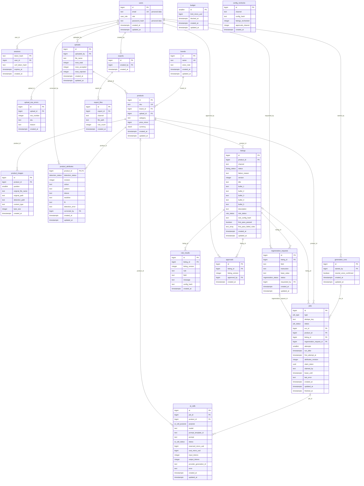

# Entity relationship diagram: Catalift

PostgreSQL. 19 tables, 23 relationships. Written beside docs/design/data-model.md and docs/design/schema.sql; the reason for every relationship is in data-model.md section 3.

## Diagram

## Relationships

- `users` to `sessions` through `sessions.user_id` (one-to-many, ON DELETE CASCADE): Deleting a user ends their sessions; a session without its user is meaningless.
- `users` to `uploads` through `uploads.uploaded_by` (one-to-many, ON DELETE RESTRICT): A user who uploaded cannot be deleted silently; uploads name who loaded the launch.
- `uploads` to `upload_row_errors` through `upload_row_errors.upload_id` (one-to-many, ON DELETE CASCADE): Row errors exist only to explain their upload and go with it.
- `brands` to `products` through `products.brand_id` (one-to-many, ON DELETE RESTRICT): A brand with products cannot be deleted; the voice note and listings depend on it.
- `uploads` to `products` through `products.upload_id` (one-to-many, ON DELETE RESTRICT): An upload with products cannot be deleted; images attach through it.
- `products` to `product_images` through `product_images.product_id` (one-to-many, ON DELETE RESTRICT): No story deletes products; an image never outlives its product unnoticed.
- `products` to `product_attributes` through `product_attributes.product_id` (one-to-zero-or-one, ON DELETE RESTRICT): One attribute row per product; no story deletes either.
- `users` to `product_attributes` through `product_attributes.corrected_by` (many-to-zero-or-one, ON DELETE RESTRICT): A reviewer who corrected attributes stays named; erase their email instead of deleting (open concern).
- `users` to `generation_runs` through `generation_runs.started_by` (one-to-many, ON DELETE RESTRICT): Runs name who started them.
- `products` to `listings` through `listings.product_id` (one-to-many, ON DELETE RESTRICT): A product with listings cannot be deleted; listings are the product's output.
- `listings` to `rule_results` through `rule_results.listing_id` (one-to-many, ON DELETE CASCADE): Rule results are derived from their listing and go with it.
- `listings` to `approvals` through `approvals.listing_id` (one-to-many, ON DELETE RESTRICT): Approvals are the audit trail of REQ-015 and must not vanish with a listing.
- `users` to `approvals` through `approvals.approved_by` (one-to-many, ON DELETE RESTRICT): An approval keeps naming its reviewer (ADR-0006).
- `listings` to `regeneration_requests` through `regeneration_requests.listing_id` (one-to-many, ON DELETE RESTRICT): A request keeps its listing; no story deletes listings.
- `users` to `regeneration_requests` through `regeneration_requests.requested_by` (one-to-many, ON DELETE RESTRICT): A request names the reviewer who asked.
- `generation_runs` to `jobs` through `jobs.run_id` (many-to-zero-or-one, ON DELETE RESTRICT): A run with jobs cannot be deleted; progress is read through it.
- `products` to `jobs` through `jobs.product_id` (one-to-many, ON DELETE RESTRICT): Jobs refer to live products; no story deletes products.
- `listings` to `jobs` through `jobs.listing_id` (many-to-zero-or-one, ON DELETE RESTRICT): Jobs refer to live listings; no story deletes listings.
- `regeneration_requests` to `jobs` through `jobs.regeneration_request_id` (many-to-zero-or-one, ON DELETE RESTRICT): A job serves its request; the request is kept.
- `jobs` to `ai_calls` through `ai_calls.job_id` (many-to-zero-or-one, ON DELETE SET NULL): The cost ledger outlives purged jobs; the link is cleared, the cost stays.
- `products` to `ai_calls` through `ai_calls.product_id` (many-to-zero-or-one, ON DELETE RESTRICT): A product's cost history must not vanish (AC-US-00-011-3).
- `users` to `exports` through `exports.created_by` (one-to-many, ON DELETE RESTRICT): An export names the reviewer who made it.
- `exports` to `export_files` through `export_files.export_id` (one-to-many, ON DELETE CASCADE): Files belong to their export and go with it.

`budget` and `config_rechecks` have no relationship: `budget` is a single row the AI gateway locks for the USD 8 check (REQ-021), and `config_rechecks` records a channel configuration change, which lives in files, not tables (D7).
